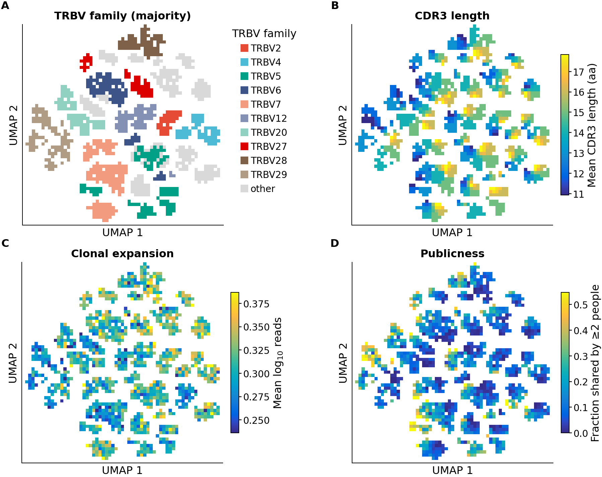
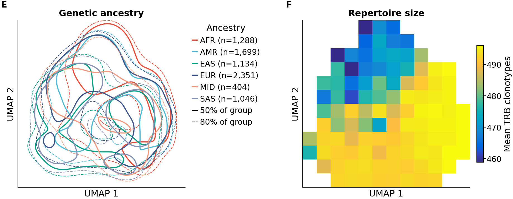
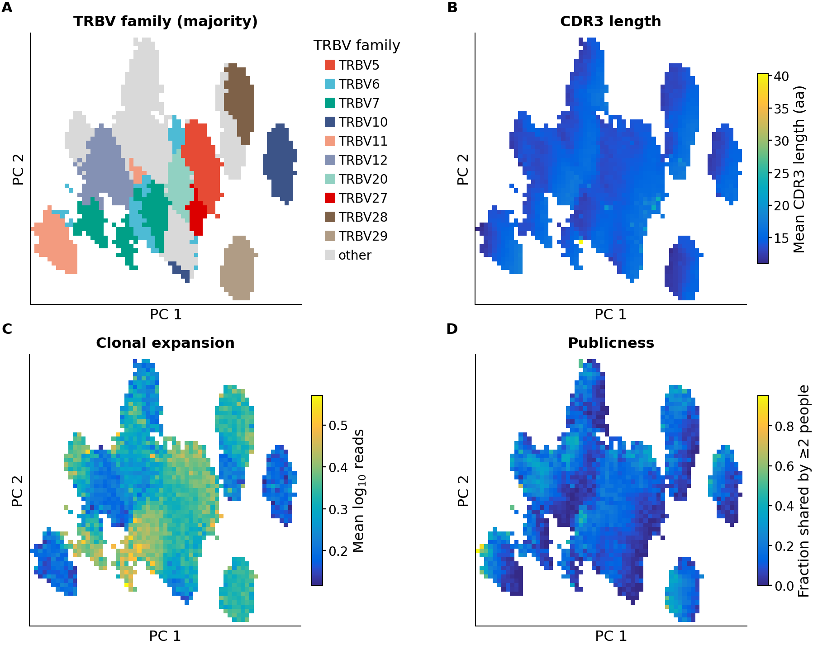
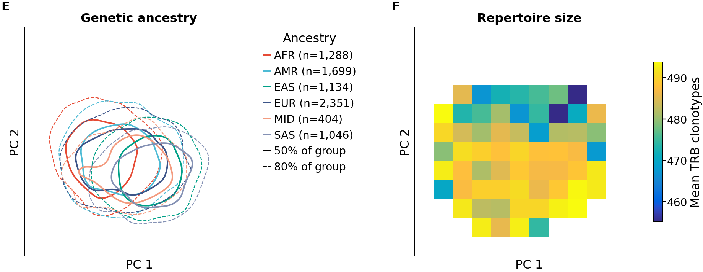

# 01 — SCEPTR embedding of the full-cohort TRB repertoire

**Question.** Once every person's TRB repertoire is turned into SCEPTR vectors, is the
resulting space organized by real receptor biology? What does it look like at the level of
single clonotypes and of whole people?

**Script:** [`scripts/01_sceptr_embedding_viz.py`](../../scripts/01_sceptr_embedding_viz.py).
**Upstream:** [`scripts/embed_cdr3s.py`](../../scripts/embed_cdr3s.py). Final run: commit
`02cf93b` (code), outputs committed in `56d0138`, 2026-09-28, main VM (n1-highmem-16, CPU).

## Data

| Step | Rule | Result |
|---|---|---|
| Cohort | LR × RNA-seq overlap, BAM ≤ 12 GB (`build_rnaseq_cohort.py`) | 7,922 people |
| Repertoire calling | TRUST4, copy-local batch, 4 VMs | 7,922 / 7,922, zero failures |
| Input file | `cdr3.out` for every person (the scored output). `report.tsv` fallback disabled | 7,922 `cdr3.out`, 0 fallback |
| Chain | TRB only (Cole Shanks, DECISIONS.md). Chain from V, then J, then C | — |
| Quality | CDR3_score ≥ 0.02; canonical junction `C…F/W`; valid residues; length ≤ 30 aa | — |
| Clonotype | unique (TRBV, CDR3aa) per person, read support summed across TRUST4 consensuses | — |
| Per-person sample | top 500 clonotypes by read support (rationale: DECISIONS.md) | median 494/person; 4.1% of people < 400, 0.1% < 100 |
| V usable by SCEPTR | `b_sceptr` accepts IMGT-functional TRBV genes only | 48 TRBV symbols accepted; 1.2% of clonotypes excluded, **flat by ancestry (1.1–1.2%)**¹ |
| Embedding | SCEPTR `b_sceptr` (beta-chain variant), input TRBV + CDR3B, 64-dim | **3,836,906 clonotypes**, 50 min |

¹ Measured on the first full run, before the length cap; the cap changes the pool by 140
clonotypes (0.004%), so the fraction carries over.

The **≤ 30 aa length cap** was added after the first run of this report. One ≥20-person cell
in Fig 1B averaged about 100 aa. In the full pool, CDR3 length has median 14 aa and 99.9% are
≤ 22 aa. Only 97 clonotypes fall between 26 and 40 aa, and then a separate mode of 2,036
clonotypes sits above 40 aa. These are assembly artifacts that cluster together in embedding
space. The cap sits in the empty gap and is applied before the top-500 selection.

## Maps

- **Clonotype level:** a seeded random subsample of 200,000 clonotypes, with UMAP
  (n_neighbors 15, min_dist 0.3, Euclidean, seed 0) and PCA shown alongside.
- **Person level:** each person's vector is the mean of their clonotype vectors, with UMAP
  and PCA as above.
- **Disclosure control:** no individual point is drawn.
  - Maps are gridded, and a cell is colored only if its points come from **≥ 20 distinct
    people**. AoU's n < 20 rule is applied to participants, not points, since 20 clonotypes
    could all be one person.
  - Cell color is the mean value or the majority category.
  - Ancestry is drawn as each group's 50% / 80% highest-density contour (Gaussian KDE).
  - Points in hidden cells: 1.1% (Fig 1), 2.1% (Fig 2), 2.7% (S1a), 4.1% (S1b).
- **Colors:** limits are the 2nd–98th percentile of cell values.
- **Style:** all figures use cnsplots (David Bonet, DECISIONS.md).

## Figure 1 — clonotype map (UMAP)



- **A, TRBV family.** The space breaks into islands by V family. Some families split into
  several islands (TRBV5, TRBV7, TRBV12), consistent with separate genes within a family. The
  same islands appear in the linear PCA (S1a), so this is not a UMAP artifact. **This is a
  check, not a discovery:** the V gene is a model input. The same-V vs different-V cosine gap
  is 0.255 with V as input, against 0.019 for the CDR3-only benchmark
  (`results/cdr3_embedding_*.csv`), which confirms the V-encoded CDR1/CDR2 information is in
  the vectors.
- **B, CDR3 length.** Within each V island, CDR3 length runs as a smooth gradient, clearest
  in S1a. So the second organizing axis, after V, is the known dominant axis of TCR sequence
  variation.
- **C, clonal expansion.** Mean read support differs systematically between islands, i.e.
  by V gene: TRBV10 is low, several central islands are high. This could be biology (V-gene
  usage in expanded clones) or V-specific differences in TRUST4 assembly or recovery. **Not
  separable here; not interpreted.**
- **D, publicness.** 14.3% of clonotypes are carried by ≥ 2 people. Shared clonotypes
  concentrate in small hotspots, and these sit at the **short-CDR3 end of their V island**
  (compare B and D in S1a: the TRBV29 and TRBV11 islands). That matches established biology:
  public TCRs are enriched for short, near-germline junctions with high generation
  probability. **Visual only; not yet quantified.** The 14.3% is higher than typically
  quoted, plausibly because only each person's most expanded clones are kept and matching is
  at the amino-acid level across 7,922 people. It is unverified.

## Figure 2 — person map (UMAP)



- **E, genetic ancestry.** All six groups overlap heavily; no ancestry forms its own
  cluster. The group centers are shifted modestly (for example, AFR's 50% region sits
  higher). That is plausible biology, because HLA allele frequencies differ by ancestry and
  HLA genotype shapes TRBV usage. It is equally consistent with technical differences.
  **Observation only; not tested.**
- **F, repertoire size.** One region collects people with somewhat fewer clonotypes (mean
  about 460–475, against about 495 elsewhere). In PCA, person PC1 correlates with repertoire
  size (Spearman ρ = −0.21, p ≈ 1e-77; PC2 ρ = +0.12). This is expected arithmetic, not
  biology: a mean over fewer vectors is noisier. It concerns the 4.1% of people under 400
  clonotypes. **Any person-level analysis must adjust for or restrict on repertoire size.**
- Person PCA: PC1 18.5% and PC2 12.9% of variance. Clonotype PCA: PC1 4.5% and PC2 3.8%,
  i.e. clonotype variance is spread across many dimensions, as expected for a 64-dim
  learned space.

## Supplement S1 — PCA versions




## Caveats

- **The V gene is an input**, so V-driven structure (Fig 1A, and much of any person-level
  structure) is partly by construction.
- **The top-500 cap is inherited, not tuned.** A robustness check across caps
  (100 / 250 / 500 / all) is owed before any claim.
- **Mean pooling is a crude person representation.** It is sensitive to repertoire size
  (Fig 2F) and to V-usage composition.
- **Bulk RNA-seq gives unpaired β chains.** Alpha-chain information is absent by design.
- **All observations here are descriptive.** Nothing is tested against HLA or disease.
  That is out of scope for this report.

## Open follow-ups (not scheduled)

1. Quantify publicness vs CDR3 length (Fig 1B–D). This is cheap and aggregate.
2. Decide whether Fig 1C's between-V expansion differences are biology or TRUST4 recovery.
3. Cap-robustness check (item 2 of the caveats).
4. Quantify Fig 2E: how well ancestry can be predicted from the person vector, against
   chance. This belongs with the HLA work, where ancestry is a confounder.

## Reproduce (on the VM, from `aleix/RNA-seq/`)

```bash
nohup bash -c 'pixi run python3 -u scripts/embed_cdr3s.py ~/pipeline_outputs/rnaseq/cohort_full.tsv --models sceptr > ~/embed_full.log 2>&1 && pixi run python3 -u scripts/01_sceptr_embedding_viz.py > ~/viz01.log 2>&1' > /dev/null 2>&1 &
```

Outputs:
- Figures and `summary.csv` go to `~/pipeline_outputs/rnaseq/reports/01_sceptr_embedding_viz/`.
- Embeddings and aligned pools (real research_ids, **VM-local only, never commit**) go to
  `~/pipeline_outputs/rnaseq/embeddings/`.
- `--style dots` redraws every point for inspection on the VM only; those figures are never
  shared.
