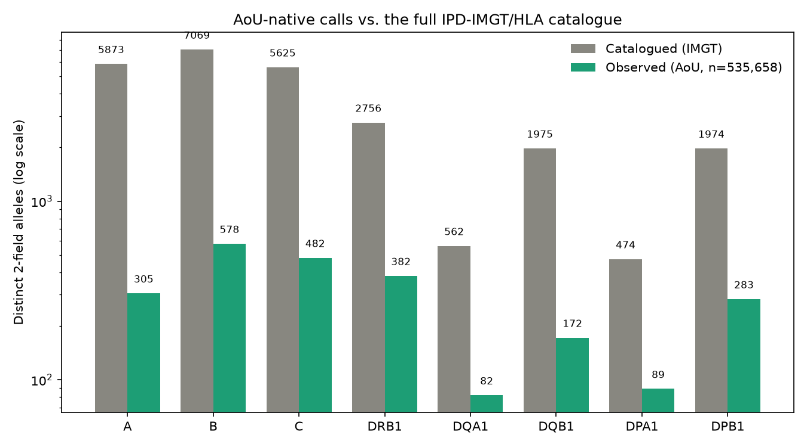
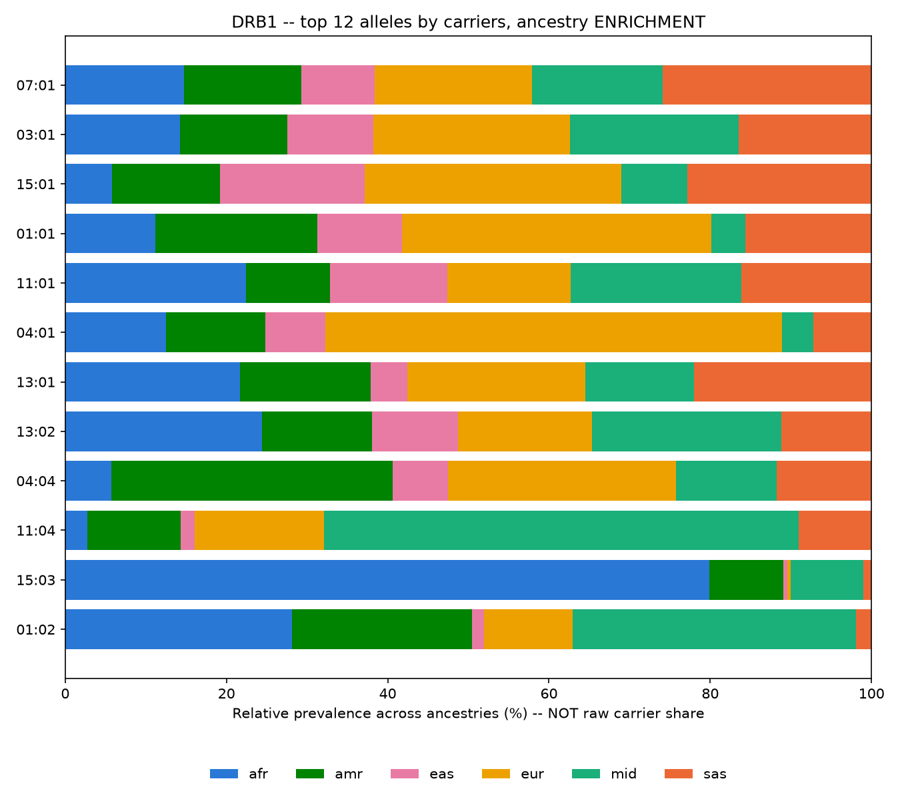
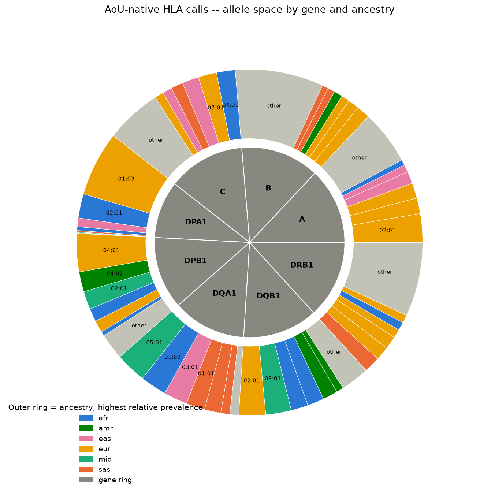

# AoU-Native HLA Callset: Validation Report

**Summary.** All of Us provides a pre-computed, direct-calling HLA callset for 535,658 short-read participants. This report evaluates its origin, completeness, and reliability using aggregate population-genetics checks and by cross-referencing against the official IMGT/HLA allele catalogue. The callset is exhaustive and behaves like real population-genetic data on every check performed. Two structural limits apply: a 3-field resolution ceiling, and a strong European-ancestry skew in the cohort. One locus, DRB1, is flagged as the least reliable by two independent methods.

---

## 1. Origin

| | |
|---|---|
| Dataset | `hla_genotypes.tsv`, v9 CDR (`C2025Q4R6`), Controlled Tier |
| Input data | Short-read WGS (srWGS) CRAMs |
| Calling method | Ensemble of HLA-HD, Polysolver, and OptiType (confirmed from the v9 data organization document, p.17) |
| Output | One row per participant, with allele columns for 30 genes (8 classical, 22 non-classical/pseudogenes) |
| Resolution | 2 to 3 field, variable by evidence |
| Long-read equivalent | None. AoU provides no long-read HLA callset. |

**AoU's own quality control.** The *All of Us Genomics & Multi-omics Quality Report* for CDR v9 is publicly accessible without Workbench login [1]. It benchmarks srWGS variant calling against 8 GIAB/NIST reference samples (an NA12878 duplicate, the Ashkenazi trio, and a Han Chinese ancestry sample), reporting SNV sensitivity of 0.984 to 0.9865 and precision of 0.9991 to 0.9997, and indel sensitivity of 0.9708 to 0.9904 and precision of 0.9961 to 0.9988 (Table 8, p.27-28).

HLA is not locus-specifically benchmarked anywhere in that 145-page report. It appears only as a named auxiliary data product; the "challenging medically relevant genes" section covers KCNE1, CBS, and MAP2K3, not HLA or the chr6 MHC region. AoU's general-genome accuracy figures reflect the underlying variant-calling pipeline, not the HLA ensemble's own accuracy. The cross-tool pilot described in this project (n=60, Experiment D) is, as far as this review found, the only HLA-locus-specific reliability evidence available for this dataset, from any source.

## 2. Exhaustiveness

- 535,658 individuals have HLA calls, all joinable to genetic-ancestry labels.
- Missingness is effectively zero at every one of the 8 classical genes; 99.998% of individuals are fully resolved across all 8 loci.
- Resolution is capped at 3-field, universally: zero 4-field calls across the entire cohort. Any downstream use requiring 4-field resolution needs an independent caller (SpecHLA or SpecImmune), not this callset.

**Cohort composition by genetic ancestry:**

| Ancestry | n | % |
|---|---|---|
| EUR | 302,712 | 56.5 |
| AMR | 107,928 | 20.1 |
| AFR | 100,798 | 18.8 |
| EAS | 15,893 | 3.0 |
| SAS | 6,176 | 1.2 |
| MID | 2,151 | 0.4 |
| Total | 535,658 | 100 |

## 3. Quality and reliability

Individual-sample truth checking is not feasible at this scale, so the callset was tested against properties real population-scale HLA data must satisfy: internal diversity, external frequency concordance, Hardy-Weinberg equilibrium, and catalogue completeness.

**Allelic diversity.** 91 to 96% of each locus's distinct 2-field alleles occur at less than 1% frequency, the expected long-tailed shape for a hyperpolymorphic region. A collapsed or broken caller would show a flatter distribution.

| Gene | Distinct 2-field alleles | Rare (<1%) share | Most common allele |
|---|---|---|---|
| A | 305 | 93% | 02:01 (22.1%) |
| B | 578 | 96% | 07:02 (9.7%) |
| C | 482 | 96% | 04:01 (13.7%) |
| DRB1 | 382 | 93% | 07:01 (11.7%) |
| DQA1 | 82 | 91% | 05:01 (24.0%) |
| DQB1 | 172 | 92% | 02:01 (20.3%) |
| DPA1 | 89 | 94% | 01:03 (70.5%) |
| DPB1 | 283 | 95% | 04:01 (31.9%) |

**External frequency concordance.** Three alleles were checked against independently published population frequencies. This cohort pools all ancestries (56.5% European), so figures below the pure-European published values are expected.

| Allele | AoU (pooled cohort) | Published (European) | Source |
|---|---|---|---|
| A\*02:01 | 22.1% | 27.1-27.6% | [2] |
| DRB1\*15:01 | 9.3% | ~15.0% (northern European) | [3] |
| B\*07:02 | 9.7% | ~11% (Italian-American) | [4] |

All three land in the expected direction and magnitude.

**Hardy-Weinberg proxy.** Pooled, all-ancestry observed-to-expected homozygosity ratios are elevated at two loci (DRB1: 1.39, B: 1.46). Pooling ancestry groups with different allele frequencies inflates apparent homozygosity on its own (the Wahlund effect), so the pooled figure alone overstates the concern.

Within single ancestry groups, DPA1 stays close to 1.0 everywhere (0.98 to 1.03 across all 6 groups), consistent with its high homozygosity reflecting real population structure rather than allele dropout. DRB1 and B remain elevated even within single groups (DRB1: AMR 1.40, EAS 1.40, MID 1.70, SAS 1.30; B: EAS 1.47, MID 1.67, SAS 1.37). This is an independent, population-genetics-based signal, unrelated to any cross-tool comparison, and it identifies DRB1 as the least reliable locus.

**Allele-space coverage against the IMGT catalogue.** Every AoU-observed allele was checked against the full official IPD-IMGT/HLA catalogue (42,279 named alleles across the 8 classical genes).

| Gene | Catalogued (2f) | Observed (2f) | Coverage | Catalogued (3f) | Observed (3f) | Coverage |
|---|---|---|---|---|---|---|
| A | 5,873 | 305 | 5.2% | 2,331 | 322 | 13.3% |
| B | 7,069 | 578 | 8.2% | 2,860 | 452 | 15.6% |
| C | 5,625 | 482 | 8.6% | 2,405 | 425 | 17.3% |
| DRB1 | 2,756 | 382 | 13.9% | 1,088 | 247 | 22.3% |
| DQA1 | 562 | 82 | 14.4% | 260 | 48 | 16.2% |
| DQB1 | 1,975 | 172 | 8.7% | 825 | 114 | 13.5% |
| DPA1 | 474 | 89 | 18.8% | 242 | 73 | 29.3% |
| DPB1 | 1,974 | 283 | 14.3% | 639 | 129 | 16.3% |

Low coverage is expected: IMGT catalogues thousands of ultra-rare, family- or isolate-specific alleles unlikely to appear in any general-population sample of this size. The more direct quality signal is the reverse check: observed alleles that are not in the catalogue at all. Of 2,373 distinct 2-field alleles observed, 2,372 match the catalogue, a 99.96% match rate.

**Database version.** Cross-referencing AoU's calls against IMGT's full release history (110 historical releases, 100% of the 42,279 classical-gene allele IDs matched) places AoU's calling ensemble on an IMGT reference no older than release 3.60.0. This is a lower bound, not an exact version, but it is newer than SpecHLA's own database (3.38.0) and cannot be ruled out as matching or exceeding SpecImmune's (3.64.0).

**Cross-tool corroboration, from the n=60 pilot.**

- Reliability is locus-specific, not a single verdict. AoU-native's discordances against the two other calling methods are overwhelmingly near-misses (correct allele family), not wrong-family errors.
- At DQA1, AoU shows an ancestry-correlated discordance rate, but every off-call stays within the correct allele family: bounded imprecision, not unreliability.
- At DRB1, AoU-native is more reliable than SpecHLA's own short-read calls (SpecHLA produces real wrong-family errors at this locus; AoU-native does not). This agrees with the Hardy-Weinberg finding above: two independent methods identify the same locus as the weak point.

## 4. Ancestry structure of the allele space

The figure shows, for the 12 most common DRB1 alleles, the relative prevalence of each within every ancestry group, not raw carrier counts, which would mostly reflect cohort composition. Several alleles show strong single-group enrichment: DRB1\*15:03 is disproportionately common in the African-ancestry group, while others such as DRB1\*04:01 are strongly European-enriched. This matches known HLA population structure and is further evidence that the callset reflects real biology.

A summary view across all 8 classical genes: the inner ring shows relative diversity by gene, the outer ring breaks each gene into its most common allele groups, colored by the ancestry group where that allele is proportionally most prevalent.

## 5. Summary and recommendations

- The callset is exhaustive and, across every independent check performed (allelic diversity, external frequency concordance, Hardy-Weinberg, catalogue match rate, and the n=60 cross-tool pilot), behaves like a clean, reliable dataset.
- Two structural limits apply: the 3-field resolution ceiling, and the ancestry skew (EAS, MID, and SAS together represent 4.6% of the cohort).
- DRB1 is the one locus flagged as unreliable by two independent methods with no shared assumptions: the cross-tool pilot and the Hardy-Weinberg proxy.
- AoU's own quality control is strong for general genome accuracy but does not benchmark HLA specifically. The evidence in this report, together with the accompanying pilot, appears to be the only HLA-locus-specific reliability assessment available for this dataset.
- Recommended next step: decide how much downstream work builds directly on AoU-native calls, reliable for 7 of 8 classical genes, versus requiring independent calling (DRB1, and any use case needing 4-field resolution). A tighter ancestry-stratified frequency concordance check (European-only cohort subset against European-only published figures, rather than the pooled comparison used here) would strengthen the evidence further if needed for publication.

---

**References**

1. All of Us Research Program. *Genomics & Multi-omics Quality Report*, CDR v9 (C2025Q4R6). https://support.researchallofus.org/hc/en-us/articles/50655639562900-All-of-Us-Genomics-Multi-omics-Quality-Report
2. Eligibility for Human Leukocyte Antigen-Based Therapeutics by Race and Ethnicity. https://pmc.ncbi.nlm.nih.gov/articles/PMC10603498/
3. HLA-DRB1\*15:01 is associated with a reduced likelihood of longevity in northern European men. *Genome Medicine*. https://link.springer.com/article/10.1186/s13073-025-01554-1
4. HLA-A, -B, -C, -DRB1 allele and haplotype frequencies in Americans originating from southern Europe. https://pubmed.ncbi.nlm.nih.gov/20974205/
