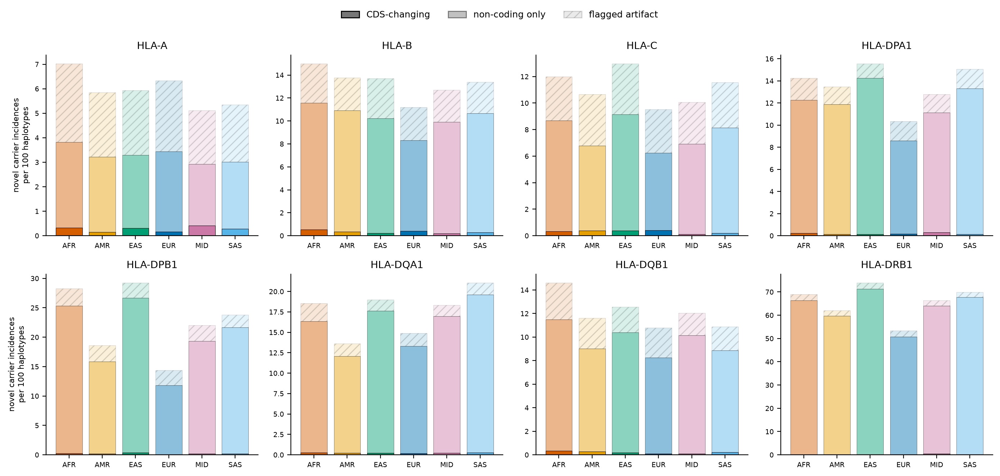
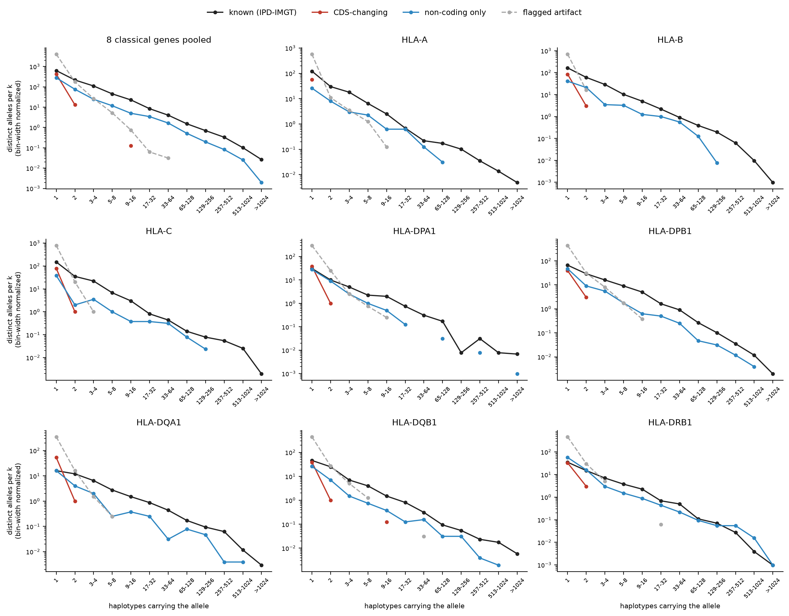

# Draft Figure 1 panels -- novel-allele rate, SFS, recurrent novel alleles

Generated by `scripts/hla_popgen/23_fig1_draft_panels.py` from committed aggregate tables only. See the module docstring for the three-bucket split and the Panel A approximation.

## Reconciliation: novel haplotypes by bucket (pooled, classical genes)

| gene | cds_changing | noncoding_only | flagged_artifact | undetermined | sum_all_buckets | richness_novel_haplotypes | noncoding_share_of_clean_% |
|---|---|---|---|---|---|---|---|
| HLA-A | 57 | 743 | 657 | 0 | 1457 | 1447 | 92.9 |
| HLA-B | 91 | 2333 | 729 | 1 | 3154 | 3133 | 96.2 |
| HLA-C | 80 | 1707 | 826 | 0 | 2613 | 2594 | 95.5 |
| HLA-DPA1 | 40 | 2698 | 407 | 0 | 3145 | 3132 | 98.5 |
| HLA-DPB1 | 45 | 4487 | 627 | 0 | 5159 | 5125 | 99.0 |
| HLA-DQA1 | 55 | 3509 | 395 | 0 | 3959 | 3931 | 98.5 |
| HLA-DQB1 | 50 | 2214 | 603 | 0 | 2867 | 2839 | 97.8 |
| HLA-DRB1 | 39 | 14268 | 577 | 0 | 14884 | 14670 | 99.7 |

`sum_all_buckets` should sit within ~1-2% of `richness_novel_haplotypes` (different join paths in 03 vs 04).

## Panel A -- novel carrier incidences per 100 haplotypes

| gene | bucket | AFR | AMR | EAS | EUR | MID | SAS |
|---|---|---|---|---|---|---|---|
| HLA-A | cds_changing | 0.32 | 0.15 | 0.31 | 0.17 | 0.42 | 0.29 |
| HLA-A | flagged_artifact | 3.21 | 2.62 | 2.64 | 2.89 | 2.19 | 2.33 |
| HLA-A | noncoding_only | 3.5 | 3.07 | 2.98 | 3.26 | 2.5 | 2.73 |
| HLA-B | cds_changing | 0.55 | 0.35 | 0.21 | 0.4 | 0.21 | 0.29 |
| HLA-B | flagged_artifact | 3.43 | 2.86 | 3.48 | 2.88 | 2.79 | 2.74 |
| HLA-B | noncoding_only | 11.01 | 10.55 | 10.01 | 7.92 | 9.7 | 10.37 |
| HLA-C | cds_changing | 0.32 | 0.37 | 0.38 | 0.41 | 0.1 | 0.2 |
| HLA-C | flagged_artifact | 3.31 | 3.88 | 3.83 | 3.29 | 3.15 | 3.4 |
| HLA-C | noncoding_only | 8.37 | 6.42 | 8.77 | 5.83 | 6.82 | 7.94 |
| HLA-DPA1 | cds_changing | 0.23 | 0.13 | 0.14 | 0.15 | 0.31 | 0.12 |
| HLA-DPA1 | flagged_artifact | 1.99 | 1.57 | 1.31 | 1.77 | 1.65 | 1.76 |
| HLA-DPA1 | noncoding_only | 12.02 | 11.75 | 14.11 | 8.43 | 10.82 | 13.2 |
| HLA-DPB1 | cds_changing | 0.23 | 0.17 | 0.35 | 0.08 | 0.21 | 0.21 |
| HLA-DPB1 | flagged_artifact | 2.95 | 2.77 | 2.61 | 2.56 | 2.71 | 2.14 |
| HLA-DPB1 | noncoding_only | 25.08 | 15.66 | 26.31 | 11.72 | 19.1 | 21.44 |
| HLA-DQA1 | cds_changing | 0.27 | 0.24 | 0.21 | 0.19 | 0.21 | 0.29 |
| HLA-DQA1 | flagged_artifact | 2.2 | 1.54 | 1.35 | 1.6 | 1.36 | 1.47 |
| HLA-DQA1 | noncoding_only | 16.08 | 11.84 | 17.43 | 13.13 | 16.77 | 19.32 |
| HLA-DQB1 | cds_changing | 0.34 | 0.26 | 0.17 | 0.08 | 0.1 | 0.2 |
| HLA-DQB1 | flagged_artifact | 3.13 | 2.61 | 2.15 | 2.53 | 1.88 | 2.0 |
| HLA-DQB1 | noncoding_only | 11.15 | 8.74 | 10.23 | 8.18 | 10.04 | 8.66 |
| HLA-DRB1 | cds_changing | 0.17 | 0.15 | 0.14 | 0.17 | 0.43 | 0.12 |
| HLA-DRB1 | flagged_artifact | 2.54 | 2.33 | 2.7 | 2.62 | 2.34 | 2.15 |
| HLA-DRB1 | noncoding_only | 66.24 | 59.55 | 71.14 | 50.55 | 63.58 | 67.63 |

## Panel B -- frequency spectrum, known vs novel

## Recurrent CDS-changing novel alleles (>=2 people): 7

| novel_id | gene | nearest_allele | novelty_class | cds_distance | n_aa_changes | n_persons | n_ancestries | n_AFR | n_AMR | n_EAS | n_EUR | n_MID | n_SAS |
|---|---|---|---|---|---|---|---|---|---|---|---|---|---|
| HLA-DQB1_nov_5fe7f9c1 | HLA-DQB1 | HLA-DQB1*02:02:01:01 | protein_altering | 1.0 | 20.0 | <20 | 2 | <20 | <20 | 0 | 0 | 0 | 0 |
| HLA-DPB1_nov_fab8779c | HLA-DPB1 | HLA-DPB1*75:01 | protein_altering | 1.0 | 1.0 | <20 | 2 | 0 | <20 | <20 | 0 | 0 | 0 |
| HLA-DPB1_nov_9dfebb85 | HLA-DPB1 | HLA-DPB1*14:01:01:01 | protein_altering | 2.0 | 22.0 | <20 | 1 | 0 | 0 | <20 | 0 | 0 | 0 |
| HLA-DPA1_nov_e1ba4007 | HLA-DPA1 | HLA-DPA1*02:01:08:01 | protein_altering | 2.0 | 6.0 | <20 | 1 | <20 | 0 | 0 | 0 | 0 | 0 |
| HLA-DRB1_nov_67913fcb | HLA-DRB1 | HLA-DRB1*03:02:01:01 | protein_altering | 1.0 | 2.0 | <20 | 2 | <20 | <20 | 0 | 0 | 0 | 0 |
| HLA-B_nov_7d8c1f06 | HLA-B | HLA-B*44:02:01:02S | protein_altering | 3.0 | 1.0 | <20 | 1 | <20 | 0 | 0 | 0 | 0 | 0 |
| HLA-DRB1_nov_b9d7df6e | HLA-DRB1 | HLA-DRB1*15:03:01:01 | protein_altering | 1.0 | 4.0 | <20 | 1 | <20 | 0 | 0 | 0 | 0 | 0 |

## Recurrent non-coding-only novel alleles (>=11 people): 230

Top 30 shown; full list in `recurrent_novel_noncoding.tsv`.

| novel_id | gene | nearest_allele | novelty_class | cds_distance | n_aa_changes | n_persons | n_ancestries | n_AFR | n_AMR | n_EAS | n_EUR | n_MID | n_SAS |
|---|---|---|---|---|---|---|---|---|---|---|---|---|---|
| HLA-DPA1_nov_1e1057e0 | HLA-DPA1 | HLA-DPA1*01:03:01:18Q | beyond_cds | 0.0 | nan | 1531 | 6 | 318 | 454 | 146 | 382 | 78 | 237 |
| HLA-DRB1_nov_be8b8db7 | HLA-DRB1 | HLA-DRB1*07:01:01:01 | beyond_cds | 0.0 | nan | 1014 | 6 | 351 | 147 | 75 | 217 | <20 | 250 |
| HLA-DPB1_nov_8c360ffb | HLA-DPB1 | HLA-DPB1*04:01:01:24N | beyond_cds | 0.0 | nan | 874 | 6 | 155 | 190 | 40 | 265 | 63 | 218 |
| HLA-DQA1_nov_6038634d | HLA-DQA1 | HLA-DQA1*05:05:01:01 | beyond_cds | 0.0 | nan | 796 | 6 | 180 | 205 | 64 | 257 | 64 | 57 |
| HLA-DRB1_nov_c83a97a2 | HLA-DRB1 | HLA-DRB1*13:02:01:01 | beyond_cds | 0.0 | nan | 746 | 6 | 287 | 139 | 54 | 200 | 37 | 42 |
| HLA-DRB1_nov_192a4d88 | HLA-DRB1 | HLA-DRB1*15:02:01:02 | beyond_cds | 0.0 | nan | 672 | 6 | <20 | 57 | 275 | 104 | 29 | 227 |
| HLA-DRB1_nov_83b27ef8 | HLA-DRB1 | HLA-DRB1*13:01:01:01 | beyond_cds | 0.0 | nan | 660 | 6 | 296 | 117 | 25 | 126 | 21 | 87 |
| HLA-DPB1_nov_fb5dd6fb | HLA-DPB1 | HLA-DPB1*02:01:02:46Q | beyond_cds | 0.0 | nan | 624 | 6 | 140 | 89 | 132 | 139 | 40 | 111 |
| HLA-DRB1_nov_426924de | HLA-DRB1 | HLA-DRB1*11:01:01:12N | beyond_cds | 0.0 | nan | 616 | 6 | 39 | 126 | 112 | 209 | 37 | 107 |
| HLA-DRB1_nov_d7cce50d | HLA-DRB1 | HLA-DRB1*03:01:01:01 | beyond_cds | 0.0 | nan | 610 | 6 | 285 | 113 | 36 | 103 | 54 | 38 |
| HLA-DQB1_nov_42de7bef | HLA-DQB1 | HLA-DQB1*02:02:01:01 | beyond_cds | 0.0 | nan | 600 | 6 | 247 | 132 | 32 | 122 | 22 | 63 |
| HLA-DQA1_nov_d67f5924 | HLA-DQA1 | HLA-DQA1*01:02:01:01 | beyond_cds | 0.0 | nan | 598 | 6 | 203 | 79 | 198 | 108 | <20 | 30 |
| HLA-DRB1_nov_b17cb388 | HLA-DRB1 | HLA-DRB1*09:01:02:01 | beyond_cds | 0.0 | nan | 583 | 6 | 181 | 61 | 314 | 29 | <20 | <20 |
| HLA-DRB1_nov_03989817 | HLA-DRB1 | HLA-DRB1*04:01:01:01 | beyond_cds | 0.0 | nan | 542 | 6 | 103 | 99 | <20 | 300 | <20 | 28 |
| HLA-DRB1_nov_14dc5a42 | HLA-DRB1 | HLA-DRB1*11:01:02:01 | beyond_cds | 0.0 | nan | 500 | 5 | 412 | 81 | <20 | <20 | <20 | 0 |
| HLA-DPB1_nov_3af63df7 | HLA-DPB1 | HLA-DPB1*01:01:01:01 | beyond_cds | 0.0 | nan | 463 | 6 | 295 | 61 | 77 | 32 | <20 | <20 |
| HLA-DRB1_nov_57f27c1d | HLA-DRB1 | HLA-DRB1*03:02:01:01 | beyond_cds | 0.0 | nan | 443 | 5 | 361 | 81 | 0 | <20 | <20 | <20 |
| HLA-DRB1_nov_bd15c6da | HLA-DRB1 | HLA-DRB1*04:05:01:01 | beyond_cds | 0.0 | nan | 440 | 6 | 56 | 108 | 182 | 63 | 23 | <20 |
| HLA-DRB1_nov_975f17f0 | HLA-DRB1 | HLA-DRB1*04:03:01:01 | beyond_cds | 0.0 | nan | 435 | 6 | <20 | 86 | 81 | 78 | 73 | 111 |
| HLA-DPA1_nov_6266b1ac | HLA-DPA1 | HLA-DPA1*02:01:01:01 | beyond_cds | 0.0 | nan | 426 | 6 | 164 | 90 | 34 | 71 | <20 | 52 |
| HLA-DRB1_nov_b8fe250d | HLA-DRB1 | HLA-DRB1*11:04:01:01 | beyond_cds | 0.0 | nan | 424 | 6 | <20 | 90 | <20 | 241 | 60 | 28 |
| HLA-DRB1_nov_e644fd52 | HLA-DRB1 | HLA-DRB1*12:02:01:01 | beyond_cds | 0.0 | nan | 414 | 5 | <20 | <20 | 353 | <20 | 0 | 73 |
| HLA-DRB1_nov_e18c79ce | HLA-DRB1 | HLA-DRB1*15:01:01:01 | beyond_cds | 0.0 | nan | 411 | 6 | 39 | 57 | 65 | 131 | <20 | 125 |
| HLA-DRB1_nov_562ba757 | HLA-DRB1 | HLA-DRB1*04:04:01:01 | beyond_cds | 0.0 | nan | 405 | 6 | 41 | 168 | 25 | 151 | <20 | 23 |
| HLA-DRB1_nov_41f74291 | HLA-DRB1 | HLA-DRB1*14:54:01:01 | beyond_cds | 0.0 | nan | 388 | 6 | 89 | 81 | 58 | 123 | <20 | 33 |
| HLA-DRB1_nov_e8970cb9 | HLA-DRB1 | HLA-DRB1*04:07:01:01 | beyond_cds | 0.0 | nan | 367 | 6 | 32 | 289 | <20 | 45 | <20 | <20 |
| HLA-DRB1_nov_cf6d4420 | HLA-DRB1 | HLA-DRB1*04:02:01 | beyond_cds | 0.0 | nan | 352 | 6 | <20 | 60 | <20 | 248 | 33 | <20 |
| HLA-DPB1_nov_1f498053 | HLA-DPB1 | HLA-DPB1*105:01:01:01 | beyond_cds | 0.0 | nan | 352 | 6 | 276 | 61 | <20 | <20 | <20 | <20 |
| HLA-DRB1_nov_205f5e57 | HLA-DRB1 | HLA-DRB1*13:03:01:01 | beyond_cds | 0.0 | nan | 347 | 6 | 179 | 68 | <20 | 62 | 32 | <20 |
| HLA-DQB1_nov_04797adc | HLA-DQB1 | HLA-DQB1*03:01:01:21N | beyond_cds | 0.0 | nan | 324 | 6 | 27 | 58 | 116 | 76 | 23 | 33 |

Participant counts of 1-19 are written as `<20` (AoU dissemination policy).