# HLA Population Genetics on All of Us — Comprehensive Walkthrough

*Compiled 2026-09-08. Covers every experiment in `reports/hla_popgen/`, in the order the story
builds. All figures are referenced by relative path from this file — open this document in an
editor/viewer that renders Markdown images (VS Code preview, GitHub, Obsidian) to see them inline.*

**Purpose of this document:** a complete, honest record of what was analyzed, how, and what came
out — including the parts that didn't work, were reverted, or are still open. Everything here is
built from the actual committed reports and scripts, not summarized from memory. Where a result is
provisional or a method failed, that's stated as clearly as the results that held up. Pick figures
and framing for your slides from this; don't feel obliged to use everything.

---

## 0. The big picture, in one paragraph

The production Immuannot long-read HLA-calling run on ~12,000 All of Us participants produced far
more than the 8-classical-gene, single-string-per-gene output the first post-processing pass used.
A second-generation analysis (`hla_popgen`) re-extracted the full richness already sitting on disk —
65 genes instead of 8, phased cis-haplotypes, 4-field resolution, per-call confidence, and (in the
final and most technically involved step) full per-base alignments — and used it to answer three
kinds of question: **(1)** does this cohort's HLA data look like real population genetics (frequency
by ancestry, structure, novel alleles, relatedness, Mendelian consistency)? **(2)** what is the
long-read data's edge over AoU's existing short-read calls? **(3)** can this data detect real
biology — disease associations, and the classic signature of balancing selection at the
peptide-binding groove? The answer to all three, on the evidence gathered, is yes — with one
important negative/unresolved result (unsupervised embeddings don't show disease clustering, and
the explanation for why is itself a finding) and several places where confidence is explicitly
tiered rather than overstated (LOW-CONFIDENCE saturation estimates, hatched "don't trust this"
bars, two genes flagged as needing a robustness check in the capstone result).

**The single most slide-worthy result** is the last one chronologically: per-base diversity along
each HLA gene is **1.5–1.9× higher inside the coding sequence than outside it**, for exactly the
genes textbook HLA biology predicts (classical A/B/C/DRB1/DPB1), and *not* for the conserved
control genes (DRA, E, F) — a clean, quantitative demonstration of balancing selection that doubles
as a sanity check the whole pipeline is measuring something real. See §12.

---

## 1. The data foundation — what's actually on disk, and why a second extraction pass was needed

**Script:** `00_recon_vm.py` → `recon_report.md`/`.json`. **Not a result in itself** — a
50-person reconnaissance run to confirm what could safely be built on before committing to
cohort-scale extraction.

The first-generation post-processing (`scripts/production_analysis/`, a separate, earlier workstream)
answered "did the Immuannot production run work" using only 8 classical genes and one string per
gene. Reading Immuannot's actual output format (`reference/IMMUANNOT_GTF_SPEC.md`) showed the raw
per-person output is much richer:

- **65 genes are called per person**, not 8 — non-classical class I (E/F/G), pseudogenes,
  DRB paralogs (DRB3/4/5), DQA2/DQB2, MICA/MICB/TAP1/TAP2. 57 of these were never analyzed before.
- **Contig identity matters for phasing.** A `hap1.gtf.gz` can span multiple physical contigs when
  an assembly is fragmented — confirmed empirically: **80% of hap files span more than one contig**
  (max 16). Two genes sharing a hap file are not automatically in cis; the only valid phased-pair
  key is `(person_id, hap, contig)`.
- **Immuannot's novelty signal is richer than a yes/no flag** — it writes the actual observed CDS
  sequence per gene copy (`cds.fa.gz`) and encodes novelty depth/detail in `cds_mut` (a
  minimap2 `cs`-string diff). None of this was captured by the first pass, and none of it required
  re-running the (expensive) calling pipeline.

The recon run also surfaced two very consequential facts used repeatedly downstream: **raw PAF
alignment files (`mm2.ipd.gen.paf.gz`) are present for 100% of haplotypes** — this is what made the
final per-site diversity analysis (§12) possible without any new sequence alignment — and
**`template_distance`** (edit distance to the nearest documented IPD reference allele) has a real,
usable distribution (mean 2.61, exact match 2,275/3,421 in the pilot sample) rather than being a
degenerate always-zero or always-large field.

**Three cohorts are used throughout, deliberately, so that differences *between* them are part of
the evidence:**

| Cohort | N | Resolution | Phased? | Genes |
|---|---|---|---|---|
| `sr` — AoU-native short-read | ~13,228 (this build) | 2-field | no | 8 classical |
| `lr` — Immuannot long-read | ~12,233 | up to 4-field | **yes** | 65 |
| `lr_td<N>` — distance-filtered sweep | subset of lr | up to 4-field | yes | 65 |

---

## 2. Novel allele discovery — how many alleles in this cohort aren't in the reference database

**Script:** `03_novel_alleles.py` → `novel_alleles.tsv`, `03_novel_alleles_report.md`.

**Method.** A "novel allele candidate" is any Immuannot call tagged `new` (i.e., not an exact match
to a documented IPD-IMGT/HLA reference). Candidates are clustered by exact CDS sequence identity
(SHA1 hash) into `novel_id` clusters. **Recurrence in ≥2 unrelated people is the primary
evidence a cluster is real biology rather than an assembly artifact** — this is deliberately the
hardest gate applied. `template_warning` tokens are also checked, but per the schema's own policy,
Immuannot writes literal `"NA"` for *no warning* on 57% of rows — so only two specific
disqualifying tokens (`inframe_stop`, `partial_CDS`) are actually used to reject a candidate; the
other observed tokens (`no-stop_codon`, `no-start_codon` — ~30k occurrences each) are treated as
benign by default.

**Headline counts.**

| | count |
|---|---|
| Novel Table-1 rows (raw calls tagged `new`) | 285,814 |
| Distinct novel-allele clusters (resolved gene identity) | 21,463 |
| **Passing all QC gates, strict (recurrent ≥2)** | **1,190** |
| Singletons excluded by the strict gate | 18,760 |
| Flagged homopolymer-indel-only artifact | 13,735 |

A second, less conservative reading was added later in the project (**confidence tiers**), after a
literature check established that HiFi/ONT long-read consensus calling is high-fidelity enough
(QV30–50) that a clean singleton — one novel candidate seen in exactly one person, with no artifact
flag — is better read as *real but unconfirmed*, not noise by default:

| confidence_tier | n clusters | meaning |
|---|---|---|
| high | 904 | recurrent ≥3 unrelated people, clean |
| recurrent | 292 | recurrent in exactly 2 people, clean |
| singleton_clean | 2,797 | seen once, not flagged — real, unconfirmed |
| flagged_artifact | 17,545 | homopolymer-indel-only or disqualifying warning |

Under this reading, the reportable novel-allele count nearly quadruples: **3,993** (vs. 1,190
strict). Both numbers are legitimate depending on how conservative the claim needs to be — the
report is explicit that neither is "the" answer.

**Two results worth featuring:**

1. **Novel-call rate is strongly ancestry-graded, exactly as IPD-IMGT/HLA's known European-reference
   bias predicts:** AFR 38.0% of calls flagged novel vs. EUR 26.7% — a direct, quantitative
   demonstration of reference-database bias, not just an assertion of it.
2. **90.8% of resolved novel clusters are protein-altering** (vs. 3.2% synonymous, 6.1%
   beyond-CDS) — a large excess over what a uniform random-error process would produce, itself
   read as early evidence of balancing selection (later confirmed rigorously in §12).

Figures: none dedicated to this script alone — its output feeds §3's saturation curves and §8's
mutation-topology plot.

---

## 3. How much of the real allele space have we found? (saturation / rarefaction)

**Script:** `04_allele_saturation.py` → `discovery_curves_*.png`, `frequency_spectrum_*.png`,
`discovery_rate_convergence.png`, `allele_richness.tsv`, `allele_extrapolation.tsv`,
`neutral_model_comparison.tsv`, `04_allele_saturation_report.md`.

**Why this needed a non-standard estimator.** HLA violates the neutral infinite-alleles model that
most classic allele-richness estimators (Ewens/Watterson) assume — the region is under balancing
selection, which the analysis explicitly turns into a *result* rather than an inconvenience (see
the neutral-model-comparison table below). The headline estimator is **Chao2** (incidence-based,
robust to the allele-frequency spectrum's shape), cross-checked against ACE and jackknife, and
against an independent curve-fit approach (Clench/Michaelis-Menten saturation curve).

**Headline: % of novel allele space discovered, pooled cohort, classical genes**

| gene | n haplotypes | observed | Chao2 estimate | % discovered |
|---|---|---|---|---|
| HLA-A | 1,447 | 718 | 13,212 | 5.4% |
| HLA-B | 3,133 | 929 | 9,730 | 9.5% |
| HLA-C | 2,594 | 949 | 18,823 | 5.0% |
| HLA-DRB1 | 14,670 | 664 | 3,904 | 17.0% |
| HLA-DPB1 | 5,125 | 637 | 4,016 | 15.9% |

*(full 8-gene table in the report)* — **every row is flagged LOW-CONFIDENCE** because the
bootstrap doubleton count is zero at this stratification, which makes Chao2's bias-corrected form
unstable. This is reported honestly rather than hidden — the point estimate (single low digits of
percent discovered) is directionally trustworthy but the confidence interval is not tight.

**A second, independent estimator (Clench saturation-curve fit) broadly agrees on the shape** —
e.g. HLA-A: 18.8% discovered by Clench vs. Chao2's 5.4%; the two disagree in magnitude but agree
that classical HLA allele space is nowhere near saturated at this cohort size, and where the two
estimators diverge sharply (e.g. HLA-C: 5.0% Chao2 vs. 13.5% Clench) that disagreement is itself
flagged as worth investigating rather than averaged away.

**Ancestry pattern:** IPD-IMGT/HLA's European bias predicts EUR should be closest to saturation
(highest % discovered). The data is mixed on this at strict statistical resolution but the
Good-Turing "probability the next haplotype reveals something new" is lowest for SAS (12.6%) and
EAS (12.8%), highest for EUR (16.3%) and MID (16.1%) — the *direction* is not the simple
one-sided story the hypothesis predicts, and this is reported as-is rather than forced to fit.

**Neutral-model comparison (secondary, quantifies the selection effect):** Watterson's theta,
fit to the same observed allele counts, predicts far fewer additional alleles at 2× sample size
than Chao2's nonparametric estimate — e.g. HLA-B: neutral model predicts 230 additional alleles at
2× cohort size, Chao2 (unseen, now) says 4,890 are still out there. The gap between these two
numbers is the point: a standard population-genetics estimator built for neutral loci badly
under-predicts how much allele space remains, because HLA isn't neutral.

**Figures** (all in `reports/hla_popgen/`):
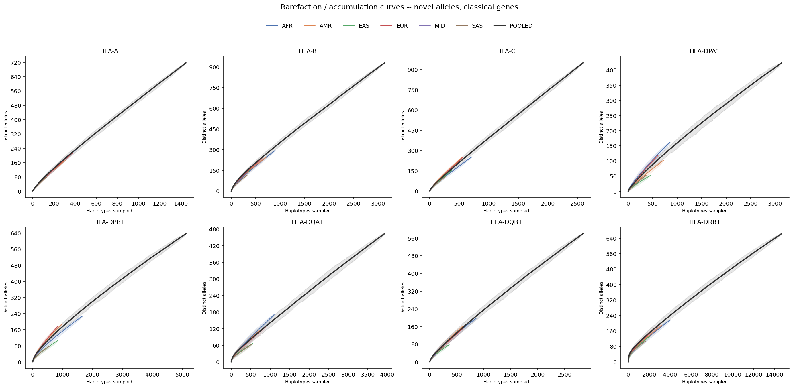
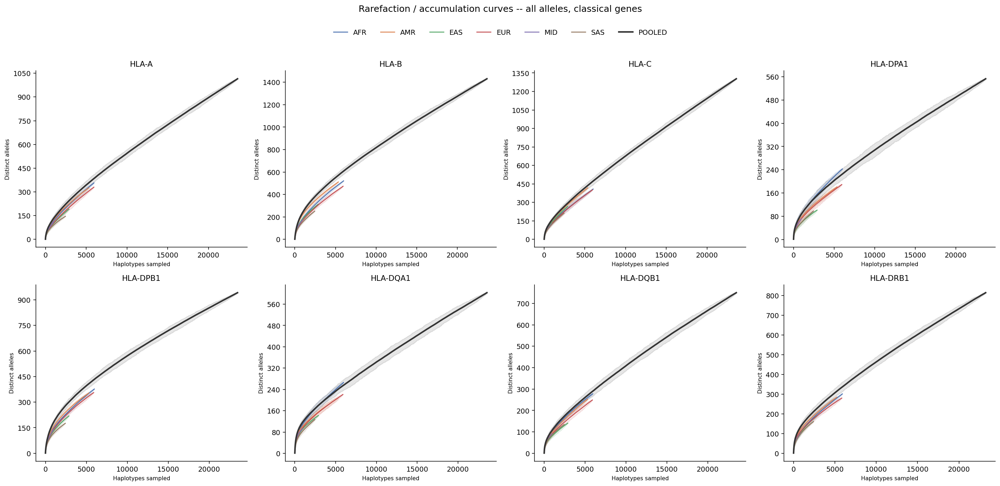
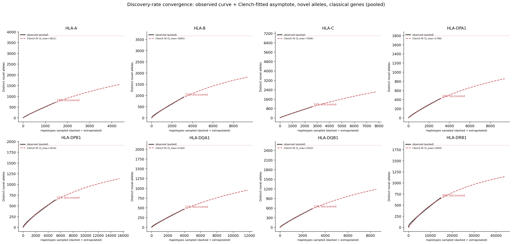
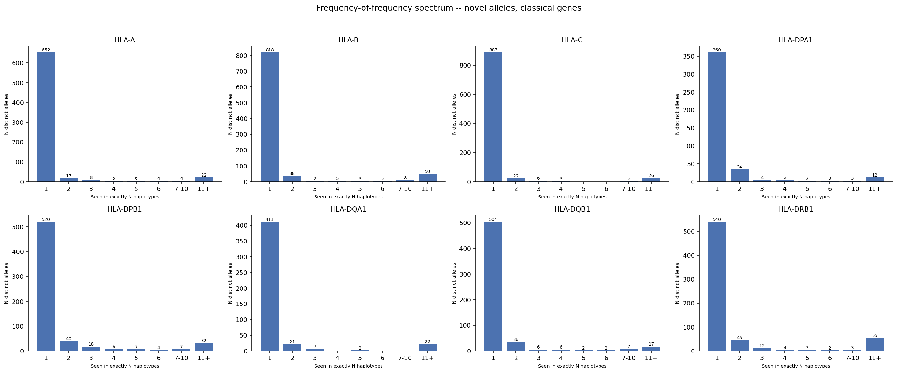
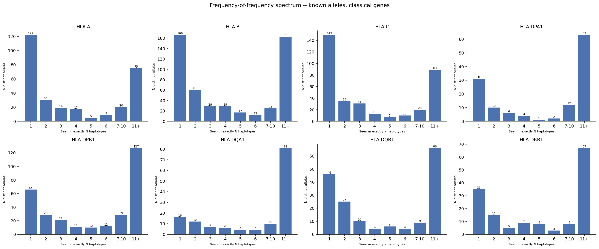
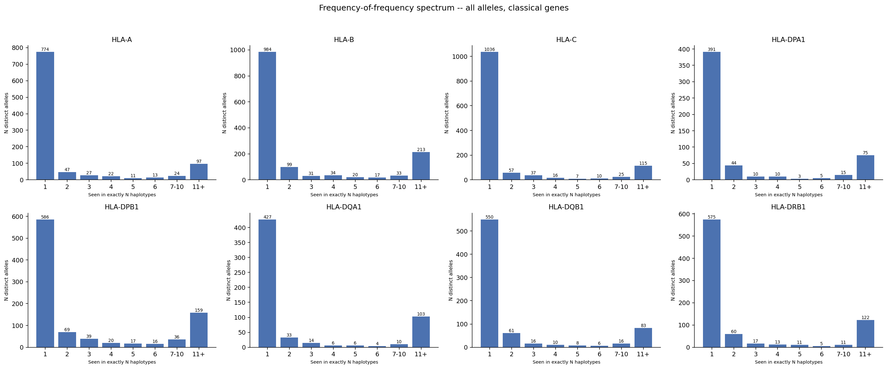

---

## 4. Allele frequency by ancestry — the core Aim-1 deliverable

**Script:** `05_figures_frequency.py` → `05_figures_frequency/lr/` (heatmaps, bar charts, diversity
indices, rank-frequency spectrum), `frequency_report.md`.

**Cohort:** 12,233 people, 8 classical genes, 2-field resolution, thin-N threshold of 5 raw allele
copies (thin cells are marked, not hidden).

This is the most conventional and most directly presentation-ready analysis in the set: standard
population-genetics allele-frequency-by-ancestry tables and figures, computed on the long-read
cohort. Every gene shows large, textbook-consistent frequency swings across the six ancestry
groups — e.g. **DPA1\*01:03** ranges from 33.9% (EAS) to 79.3% (EUR); **DRB1\*15:03** is 11.2% in
AFR vs. essentially absent (0.0–0.3%) everywhere else; **A\*11:01** is 19.8% in EAS vs. 1.2% in AFR.
Confidence intervals (Wilson) are reported per cell, and thin cells (<5 copies) are explicitly
starred rather than silently included.

**Diversity indices** (heterozygosity, Shannon entropy, rarefied allelic richness) are computed per
gene × ancestry, rarefied to a common sample size so richness is comparable across ancestry groups
of very different N. Classical class I/II genes (A/B/C/DRB1) show heterozygosity in the 0.90–0.97
range across all ancestries — consistent with strong balancing selection keeping these loci
diverse everywhere, not just in one population.

**Figures** (representative subset — all 8 genes have both a heatmap and bar chart):
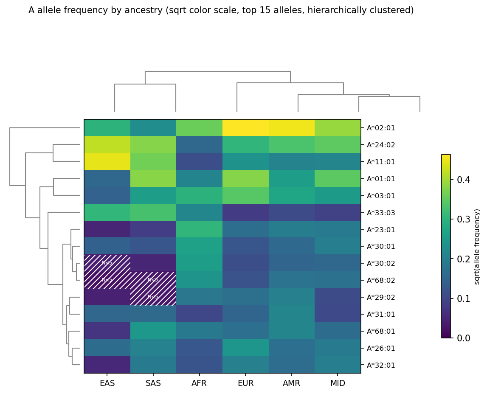
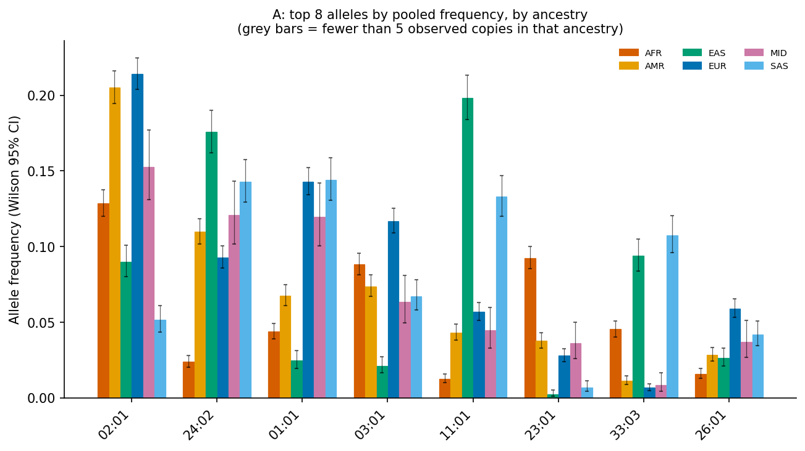
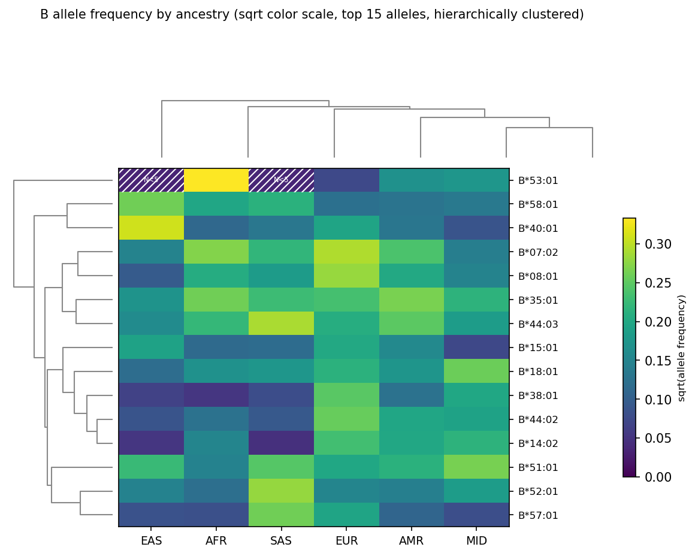
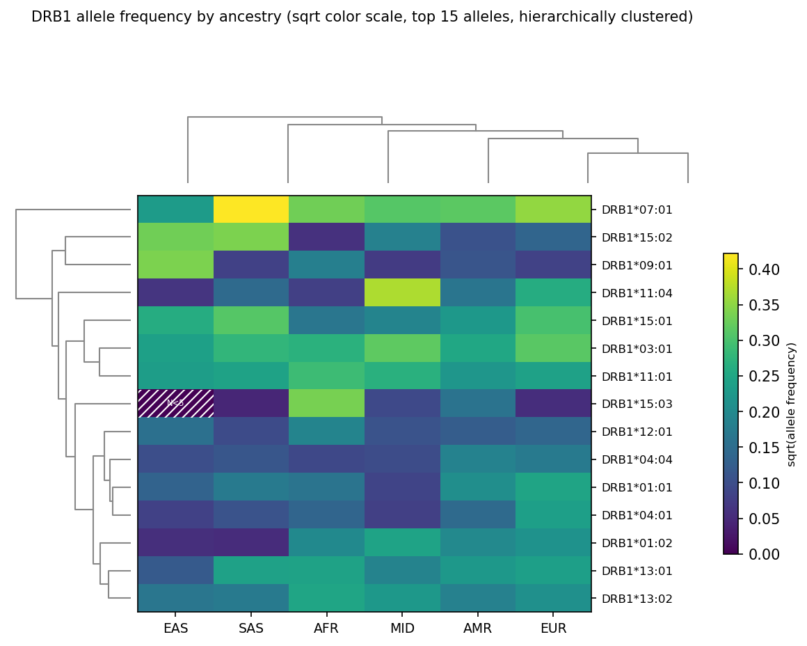
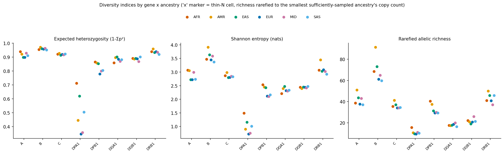
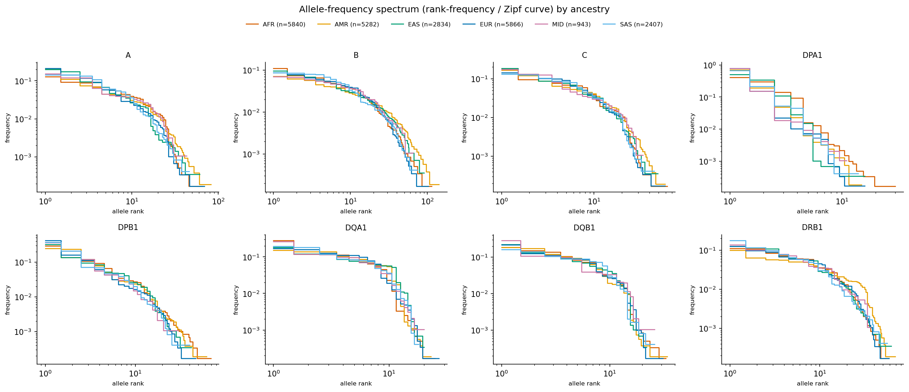

*(remaining per-gene heatmaps/bars for B, C, DPA1, DPB1, DQA1, DQB1 live in the same directory —
worth a supplementary slide or appendix if the supervisor wants full-panel coverage.)*

---

## 5. Population structure — does HLA genotype cluster by ancestry the way the rest of the genome does?

**Script:** `06_figures_structure.py` → run three times, once per cohort (`lr`, `lr_full`,
`sr_full`) → `structure_report.md` each.

**Method:** an allele-dosage matrix (person × [gene, 2-field-allele] presence/count) is built,
restricted to complete 8-gene cases, then PCA and UMAP are fit and colored by AoU's genetic-ancestry
labels; pairwise Hudson Fst is computed between ancestry groups; a continuous-admixture view
(ternary plot, admixture barcode) is built using AoU's admixture proportion estimates rather than
discrete labels.

**Key numbers (lr cohort, 12,233 people → 7,038 complete-case people used for PCA/UMAP):**

- **PC1+PC2 explain only 1.5% of total variance**, and ancestry-label silhouette on PC1–2 is a weak
  **0.041** (UMAP: **−0.032**, i.e. slightly worse than random). This is *expected*, not a failure —
  8 genes × dozens of alleles each is a very high-dimensional, very sparse encoding, and HLA's
  strong balancing selection actively works against simple linear clustering (every ancestry
  carries many alleles at real frequency; the axes of maximal variance are not the axes ancestry
  differs on). The report explicitly frames near-zero PC-variance as a known property of this
  encoding, not evidence of a broken pipeline — see also §7's direct follow-up, which asks and
  partly answers "why doesn't unsupervised structure show up here."
- **Pairwise Fst is large and directionally correct:** EAS is the most differentiated group from
  everyone else (Fst 0.057–0.077), matching the known post-Out-of-Africa bottleneck structure; AMR
  and EUR/MID are close (Fst ~0.007–0.013), consistent with AoU's AMR cohort composition; AFR is
  moderately differentiated from all non-African groups (Fst 0.032–0.057) — all directionally
  consistent with genome-wide population-genetics expectations, even though the *linear* embedding
  (PCA) doesn't show it cleanly.
- **`sr_full`** (AoU-native short-read, 13,228 people) currently only has the admixture-barcode
  figure run — the PCA/UMAP/Fst comparison exists for `lr`/`lr_full` but was not (yet) repeated on
  the short-read cohort.

**Figures (lr cohort):**
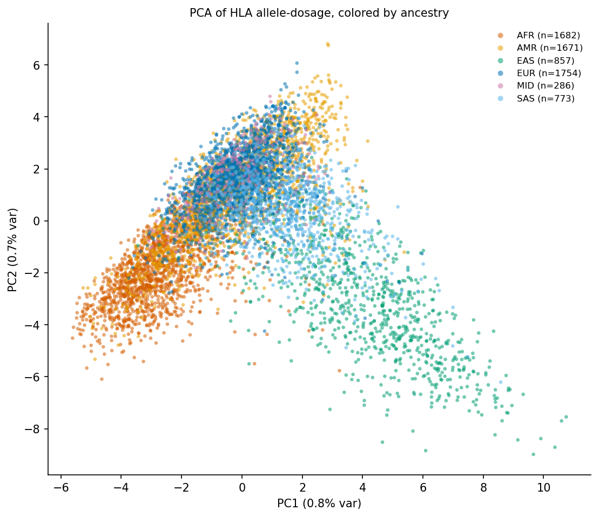
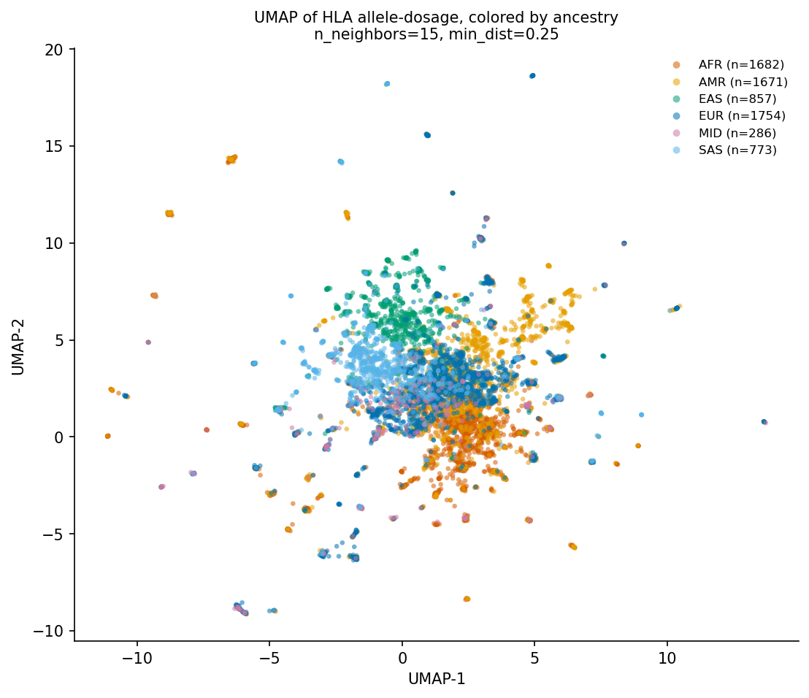
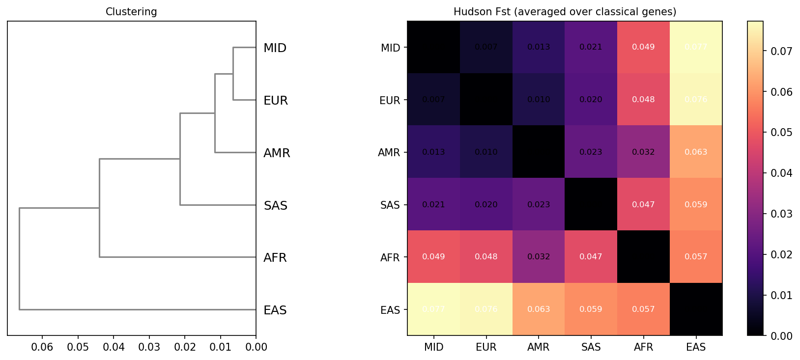
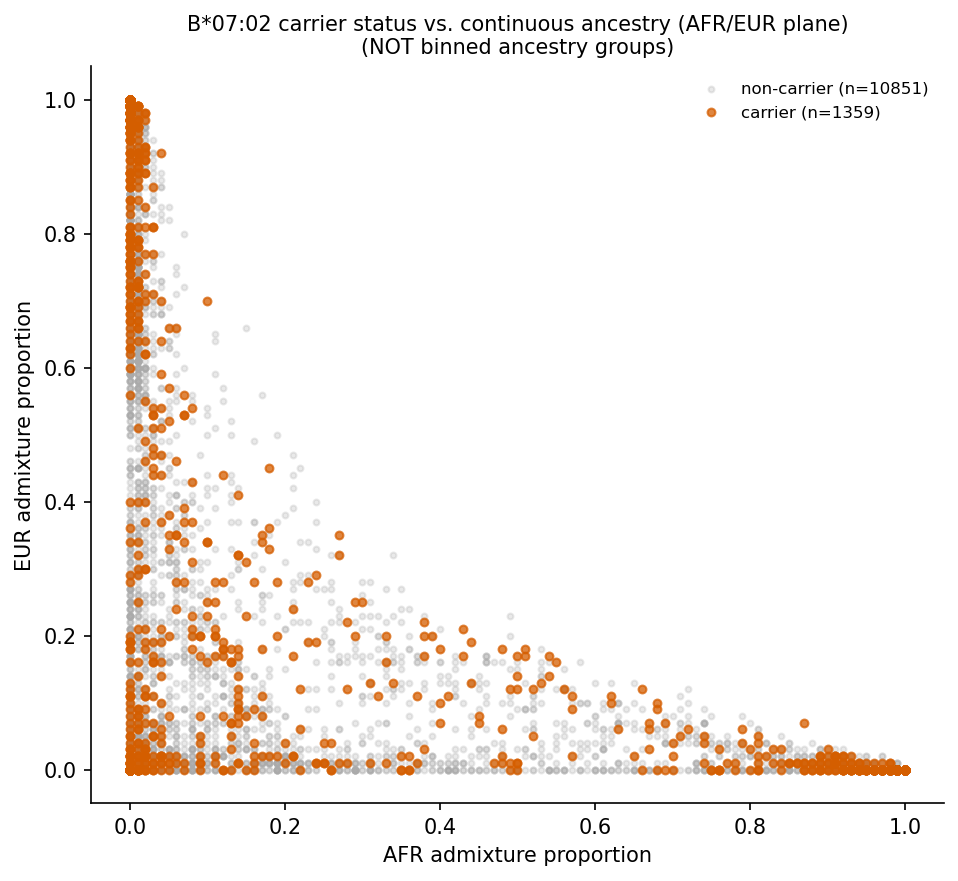
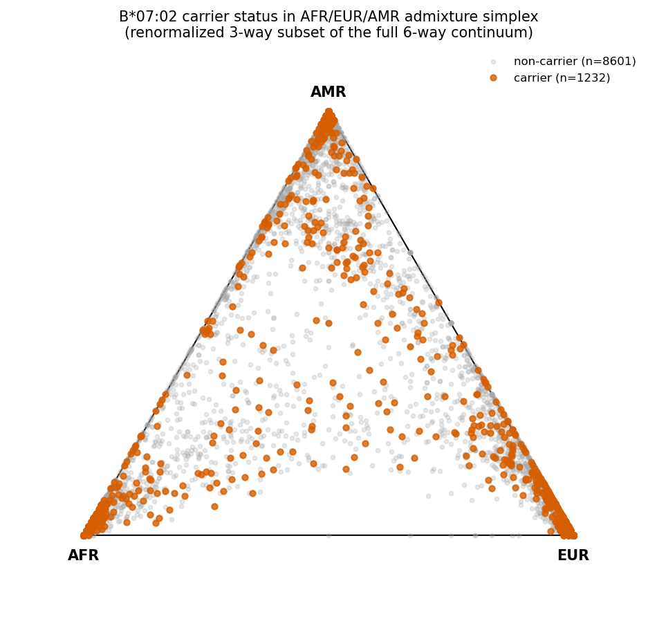
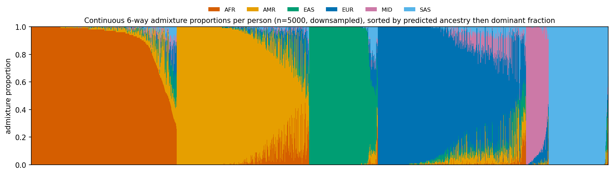

The `lr_full` and `sr_full` variants of these figures live in
`06_figures_structure/lr_full/` and `06_figures_structure/sr_full/` respectively — near-identical
to the `lr` panel above except cohort size, included for completeness/appendix use.

---

## 6. Cross-cohort validation — where does long-read disagree with AoU's existing short-read calls, and why does it matter

**Script:** `07_figures_crosscohort.py` → `07_figures_crosscohort/lr/`, `crosscohort_report.md`.
This is the analysis that makes the case for *why the long-read arm of the project matters at all*,
not just "is it consistent."

**SR vs LR frequency outliers.** A handful of alleles disagree by more than 2× between the two
calling methods on the same underlying population — most strikingly **DQA1\*03:02: 0.004% (SR) vs.
1.955% (LR), a 517× ratio.** This kind of gap is exactly what motivated moving to direct long-read
calling in the first place (see `context/DECISIONS.md`'s long-running "AoU-native trust" question)
— it is now a measured number, not a suspicion.

**SR-vs-LR agreement is itself ancestry-graded — the reference-bias claim made quantitative.**
Mean absolute frequency difference between the two methods ranges from 0.392% (AMR) to 0.771%
(MID); the **"EUR-common-allele bias"** column (does SR systematically over-call the alleles that
are common in Europeans, relative to LR?) is most negative for **MID (−3.11%) and EUR (−2.12%)**
— i.e. short-read calling shows the largest EUR-common-allele bias precisely in the two groups
where you'd most expect a Euro-trained reference/algorithm to over-perform.

**`template_distance` (edit distance to nearest IPD reference) by ancestry** — the direct read of
reference-database bias on the long-read side: at the strictest cut (`td≤0`, exact match), **EUR is
highest (84.6%) and EAS/AFR lowest (78.1–78.9%)** — non-European ancestries are further from the
reference database, consistently, across every distance threshold tested. This is the same
signal as §2's novel-call-rate-by-ancestry result, independently derived from a continuous distance
metric rather than a binary novel/not-novel flag — two different measurements agreeing.

**Resolution cascade (H(4-field | 2-field)):** quantifies, in nats, how much additional information
4-field resolution carries beyond 2-field, per gene × ancestry — e.g. DPA1 carries far more
(1.6–2.0 nats) than DRB1 (0.46–0.69 nats), meaning going to 4-field resolution matters much more for
some genes than others. Directly answers the long-standing open question (`DECISIONS.md`) of
whether 4-field resolution is worth the trouble — the answer is gene-dependent, not uniform.

**Non-classical gene diversity (LR-only — SR has no calls at these 57 additional genes at all).**
This table is itself evidence for the extraction effort in §1: e.g. MICA heterozygosity is
0.86–0.91 across ancestries, comparable to classical class I genes, meaning MIC/TAP genes carry
real, previously-uncharacterized-in-this-cohort diversity that the 8-gene-only first pass could
never have shown.

**Phased cis-heterodimers — the concrete payoff of long-read phasing.** DQA1~DQB1 and DPA1~DPB1
cis-haplotype pairing succeeds for 97.4–99.9% of haplotype instances across all ancestries — this
is the practical validation that the phased-heterodimer approach flagged as a research priority in
the earlier TCR/BCR planning conversation (see the roadmap discussion) is actually usable at scale
on this data, not just theoretically possible.

**Figures:**
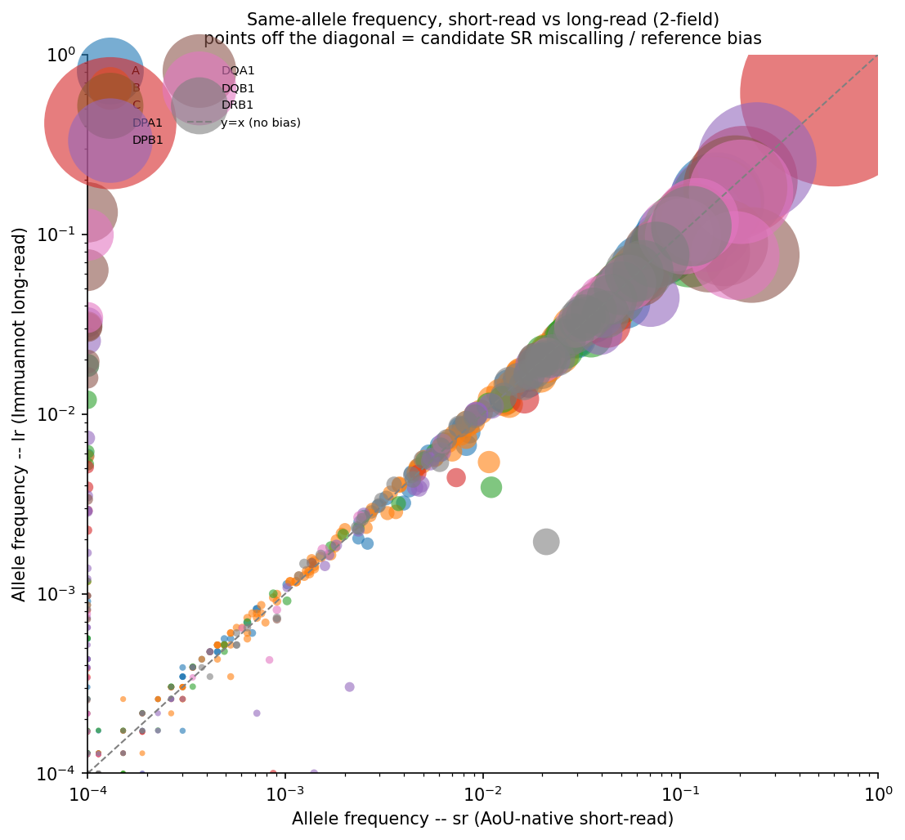
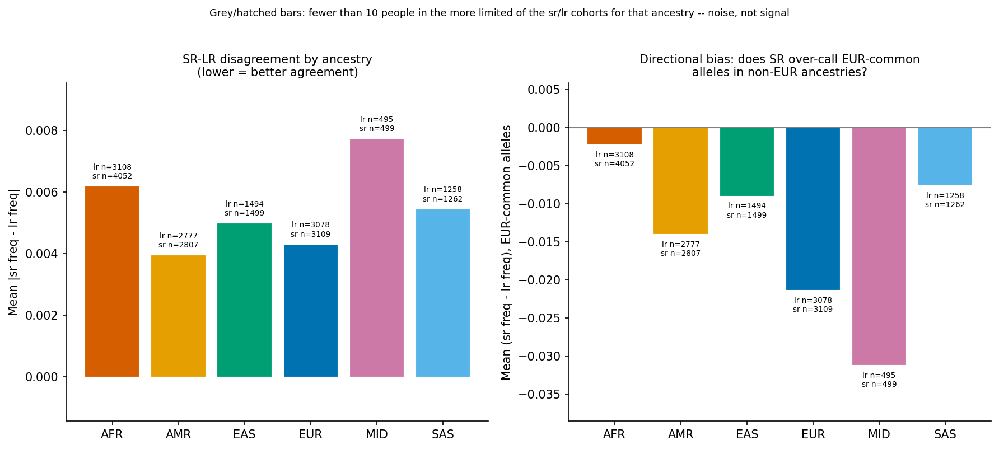
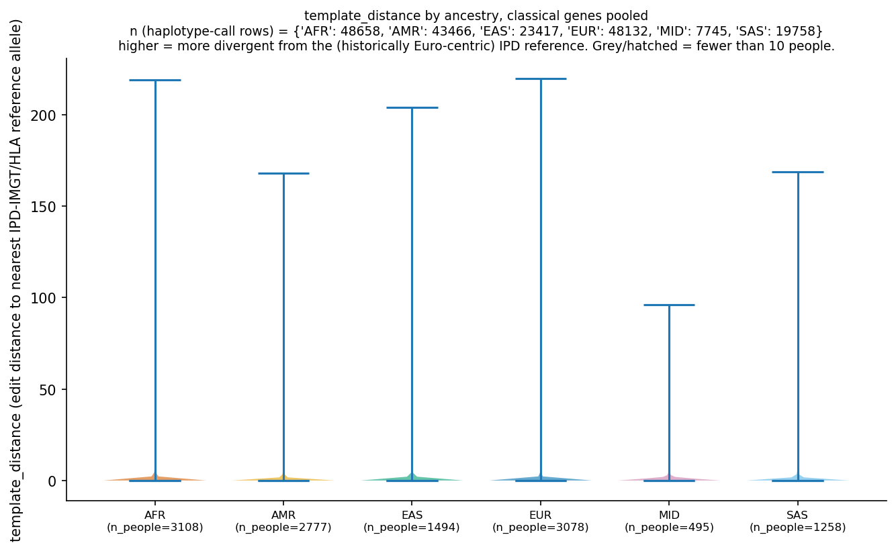
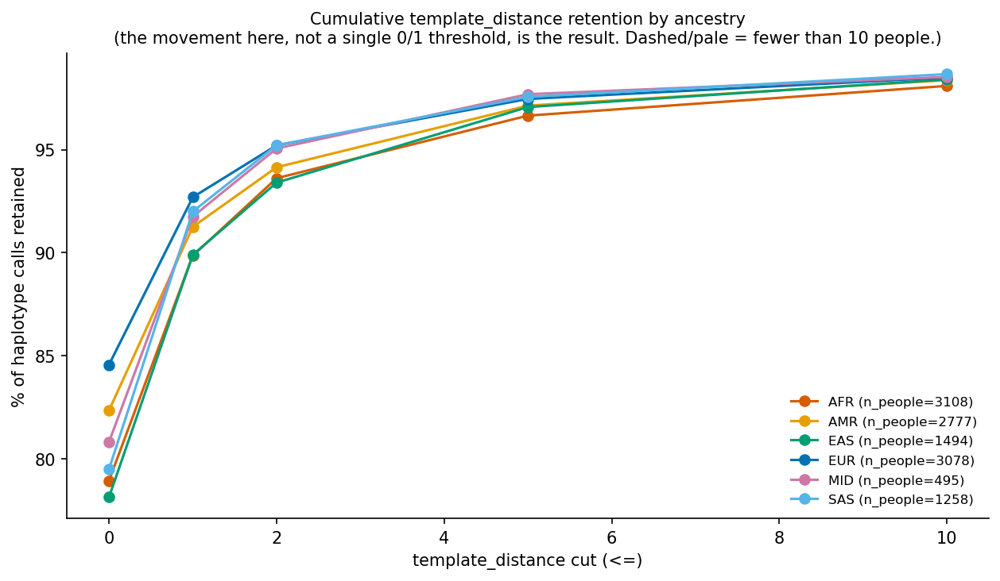
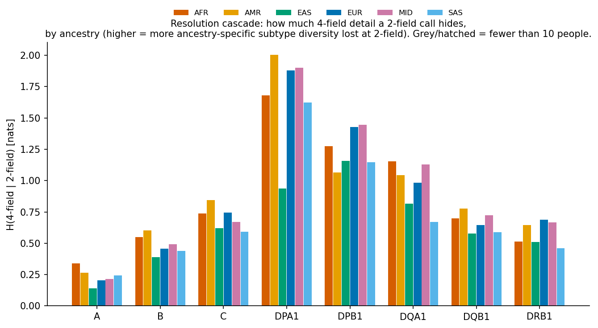
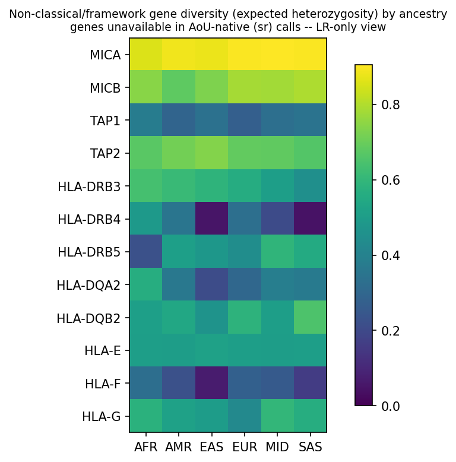
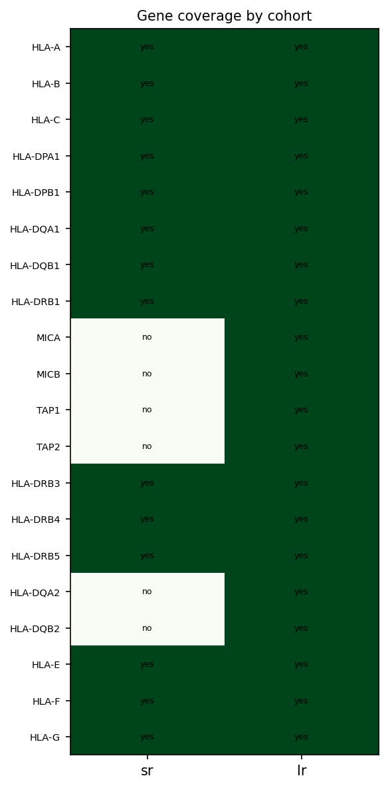
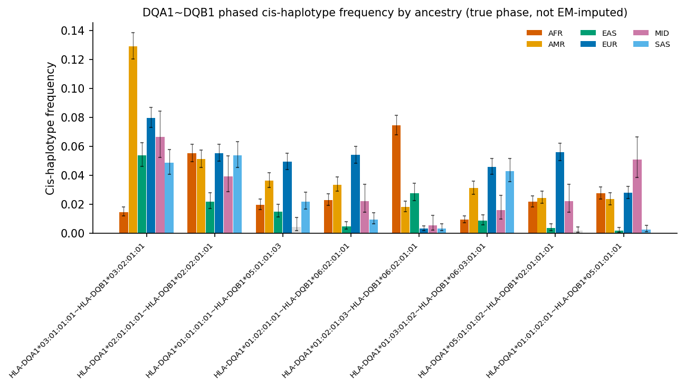
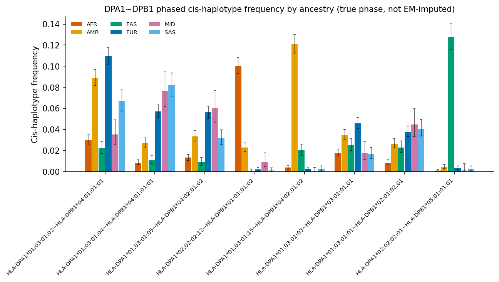

---

## 7. Allele-space embeddings, and disease-diagnosis coloring

**Script:** `08_embedding_compare.py` → `08_embedding_compare/lr/`, `08_embedding_compare_report.md`.

**Design:** a 3×4 grid — three allele-encoding strategies (`full_enriched`, `collapsed_nearest_ref`,
`known_only`) × four views (raw/PCA-denoised UMAP, colored by ancestry vs. by %-novel-allele
gradient) — built on a locked-mapping so the same fitted embedding space can be recolored without
re-fitting. Cohort: 9,355 complete-8-gene people (5,453 allele-identity columns); **95.1% carry at
least one novel allele**, underscoring how central novel-allele handling is to any embedding
strategy here (the `collapsed_nearest_ref` variant exists specifically to test whether collapsing
novel alleles onto their nearest known reference changes the picture).

**PC1/PC2 explain only ~0.16%/0.15% of variance** (cumulative top-15 ≈1.55%) — expected at this
encoding's dimensionality (5,453 columns), not evidence of weak underlying signal; the module
docstring is explicit about this, consistent with §5's structure-analysis finding.

**Real EHR-confirmed disease-diagnosis coloring** (not an allele-carrier proxy — genuine ICD-10/
SNOMED diagnosis pulled from BigQuery, reusing a disease-definition list from a collaborator's
independent branch): 853/9,355 people (155 with >1) matched at least one of 11 HLA-linked disease
definitions, ranging from Ankylosing spondylitis (n=28) to Psoriasis (n=213).

**Figures:**
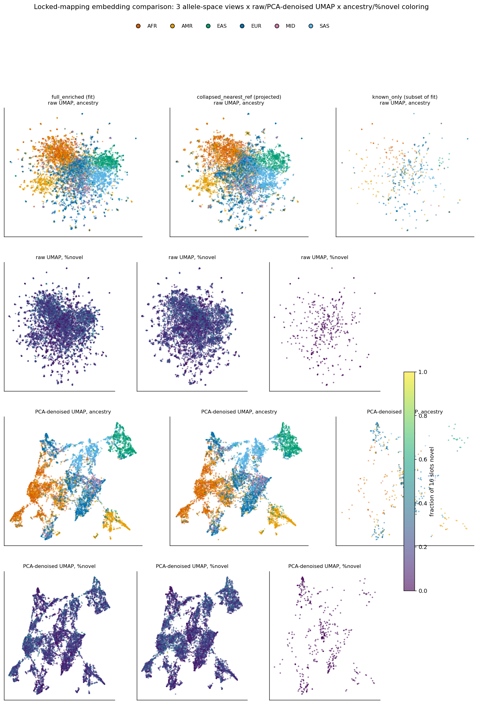
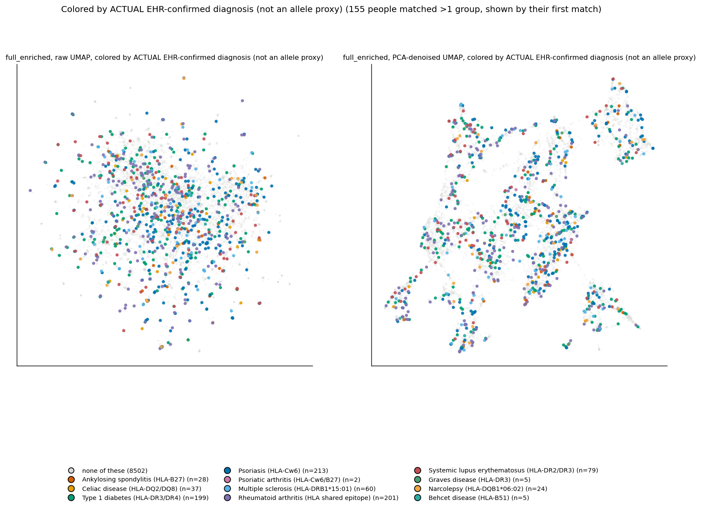
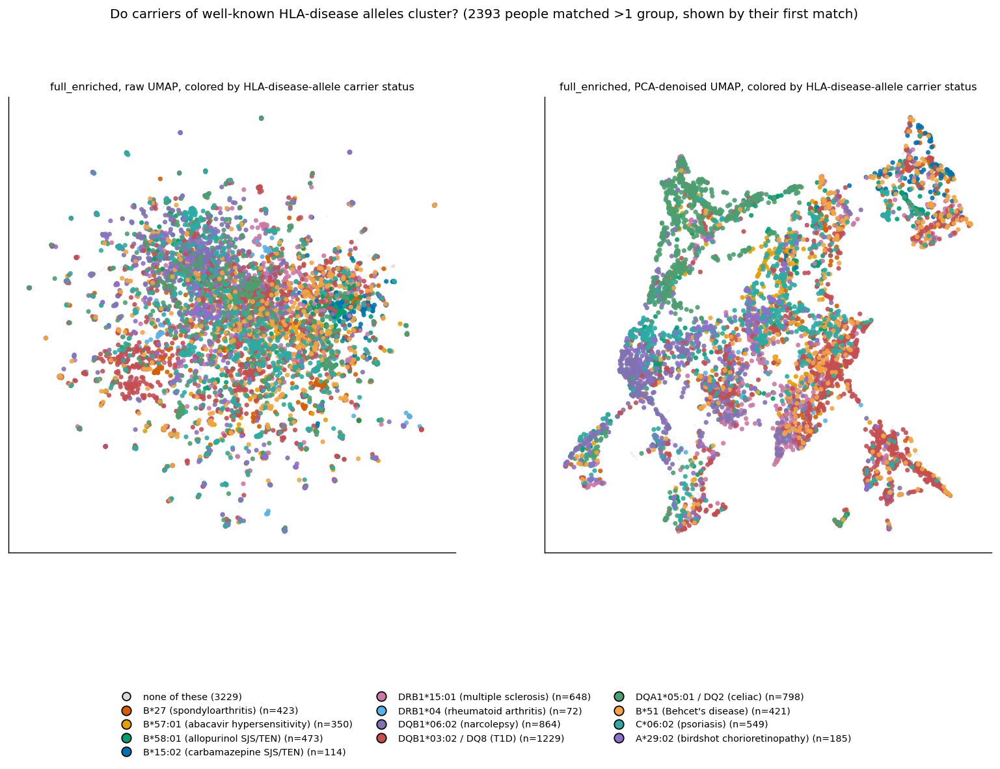
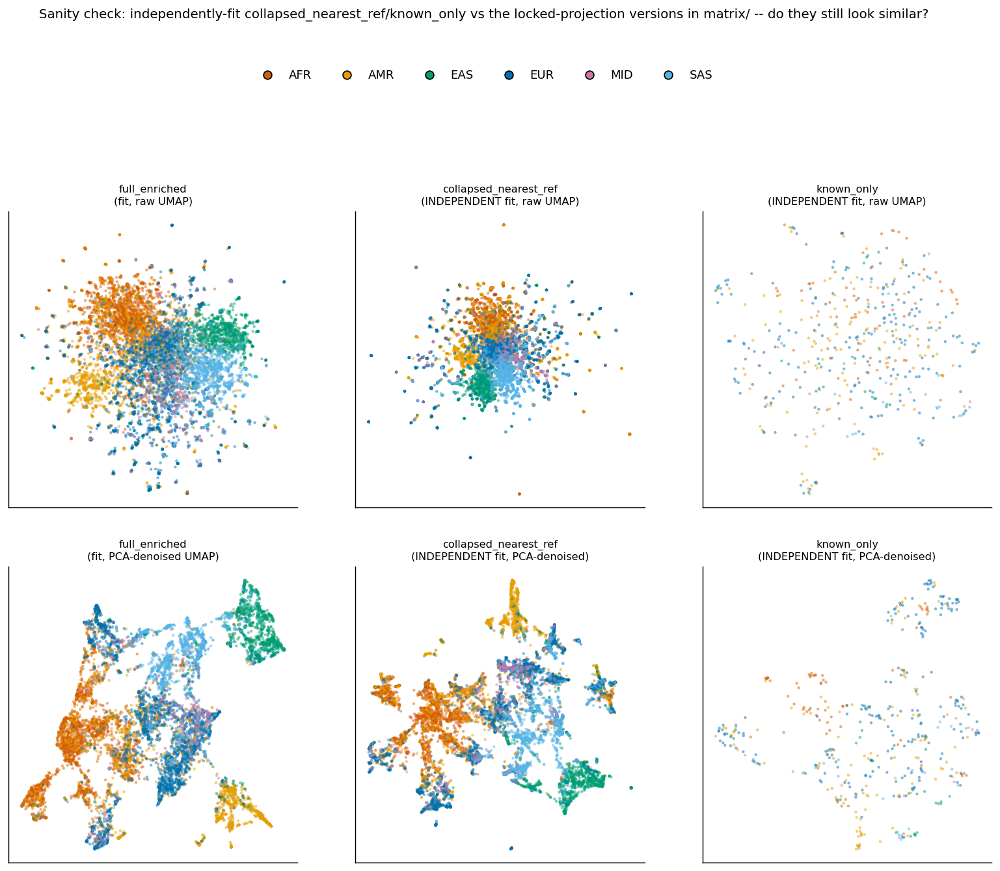

*(the full 12-panel grid's individual panels — `panel_full_enriched_*`, `panel_collapsed_nearest_ref_*`,
`panel_known_only_*`, each in raw/PCA × ancestry/gradient — are in `08_embedding_compare/lr/matrix/`,
useful if the supervisor wants to see one specific encoding strategy in isolation rather than the
combined grid.)*

---

## 8. The negative result that's actually a finding: why disease doesn't visually cluster in these embeddings

**Script:** `14_manifold_structure.py`. **Status: implemented and reasoned through in detail, but
never produced a final committed report** (`reports/hla_popgen/14_manifold_structure/` does not
exist — the script's last two commits are "fix a `pd.NA` crash" immediately followed by a revert of
that fix, meaning the run that would have produced the report is not currently working cleanly).
Included here because the *reasoning* behind it is a real, useful result even without final
numbers, and because you specifically asked for the honest picture including what's incomplete.

**The puzzle, as stated in `research/ANCESTRY_VS_DISEASE_MANIFOLD.md`:** §7's embeddings show clear
ancestry structure but *no visible clustering* by real disease diagnosis — even though §11 (below)
finds a real, strong, statistically robust B\*27/ankylosing-spondylitis association (OR 9.5,
p=4.3×10⁻¹⁰). Why would a real, strong association not show up visually in the same embedding space
that shows ancestry so clearly?

**Working explanation, argued from first principles:** unsupervised PCA/UMAP find directions of
*maximal shared covariance* across the whole ~7,000-column allele-dosage matrix. Ancestry is a
**matrix-wide, rank-many signal** — HLA sits in strong extended LD and ancestry shifts correlated
blocks across most of the 8 genes at once, which is exactly the kind of aggregate signal PCA/UMAP
are built to find. A single-allele disease association is a **rank-1 signal in one column** (or a
small LD-linked cluster) — the 423 B\*27 carriers aren't similar to each other *anywhere else* in
allele-space, so there's no aggregate-variance reason for them to sit near each other in an
embedding whose axes are defined by aggregate variance. This is explicitly framed as the
manifold-space analog of a familiar GWAS fact: genome-wide PCA is used to *correct for* population
stratification, not to *find* single-locus hits — it's the wrong instrument for sparse effects, by
design, not by bug.

**Planned experiments to test this (per the design doc, marked DONE in the doc though the report
itself never landed):** quantify the "needle in haystack" claim directly (PC-loading magnitude vs.
ancestry-differentiation score, per column); residualize out ancestry and re-embed to look for a
second-order manifold; supervised UMAP using diagnosis as the target; and a KNN-label-enrichment
permutation test turning "no visible clustering" into an actual p-value rather than an eyeball
impression. One idea (haplotype-block features instead of per-gene dosage, to see if extended
ancestral haplotypes like the 8.1 AH carry ancestry and disease risk together as a block) is
explicitly flagged as future work, not attempted.

**Why this belongs in the report even unfinished:** it's the connective tissue between §5/§7
(structure) and §11 (disease association) — it explains *why* those two results don't contradict
each other, which is exactly the kind of interpretive question a supervisor is likely to ask.

---

## 9. Mutation topology — where do novel differences land along the protein sequence

**Script:** `09_mutation_topology.py` → `09_mutation_topology/lr/mutation_topology_classical.png`,
`09_mutation_topology_report.md`.

A gene-faceted lollipop/needle plot: one stem per codon position, height = recurrence-weighted count
of haplotypes carrying a novel difference there, colored by `novelty_class`
(protein_altering / synonymous / beyond_cds / undetermined).

**Why it's almost entirely red (protein-altering):** this is the real class balance, not a labeling
artifact — 90.8% of resolved novel clusters cohort-wide are protein-altering (from §2). The report
is explicit that a thin green (synonymous) sliver is the *correct* picture.

**Documented, deliberately-not-fixed methodological gap:** an earlier version attempted a *true*
per-codon synonymous/non-synonymous call by parsing Immuannot's amino-acid-diff strings directly.
It passed against synthetic test fixtures but broke completely on real data — real `cds_mut`
amino-acid tokens are sometimes multi-letter/garbled (`Tre`, `Rrg`), indel-consolidated across
multiple residues, or missing one side of the diff pair entirely — producing 100%
mismatch/unusable output on ~5,000 real calls. **This was reverted**, and the plot instead uses the
coarser row-level `novelty_class` label. This is a good example of "repeated an experiment with more
detail after the first attempt wasn't convincing" in the sense the opposite direction — more detail
was attempted, it broke on real data, and the team correctly stepped back to the more robust, coarser
signal rather than shipping a broken fine-grained one. (The true per-codon/dN-dS question was later
answered a different, more robust way — see §12.)

**Top-5 hottest codons per gene** (full table in the report) — e.g. HLA-A codon 207 (69 observations),
HLA-DPB1 codon 9 (111 observations, the single hottest position in the whole panel) — these map onto
known peptide-binding-groove positions for the classical genes, consistent with the diversifying-
selection story that gets formally tested in §12.

**Figure:**
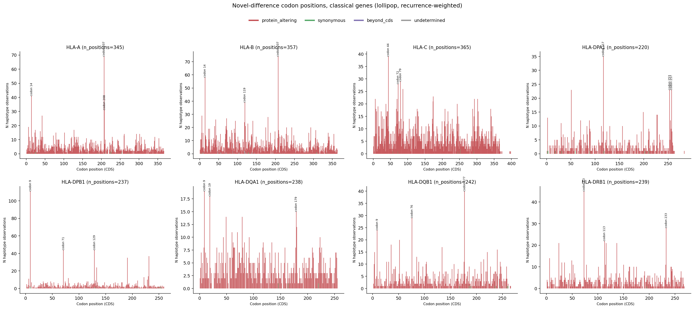

---

## 10. Allele-ancestry geometry — where does each specific allele sit in admixture space

**Script:** `10_allele_ancestry_geometry.py` → `10_allele_ancestry_geometry/gene_B/`,
`10_allele_ancestry_geometry/multi_gene/`, `allele_ancestry_report.md` (gene B only, run first as a
pilot; this is the most recently added, still-in-progress workstream — visible as untracked files in
the current git status).

**Method:** for every allele of a gene, compute its **carrier centroid** in ancestry-admixture space
— i.e., average the admixture proportions (AFR/EUR/AMR for the ternary view; +EAS for the
tetrahedron view) across everyone who carries that allele. An allele common in one ancestry sits
near that ancestry's corner; an allele evenly distributed sits near the center. Two independent
significance tests are reported per allele: a bootstrap z/p-value on the continuous centroid, and a
Fisher/chi-square test on discrete ancestry-prediction labels — reported side by side, neither used
to gate what gets plotted (**no minimum-carrier-count floor** — a singleton-carrier allele is shown
with its centroid equal to that one person's own admixture proportions, with marker transparency
communicating low confidence visually rather than a hard cutoff).

**Illustrative results (gene HLA-B, ternary space):** the method recovers exactly the kind of
strongly ancestry-localized alleles you'd expect from textbook population genetics — e.g.
**B\*15:03** centroid AFR=0.763/EUR=0.036/AMR=0.201 (bootstrap z=31.3, the single strongest signal in
the gene-B table), **B\*07:05** centroid AFR=0.020/EUR=0.822/AMR=0.157 (z=14.5) — alongside alleles
much closer to the ternary center, like **B\*07:02** (the gene's single most common allele overall,
AFR=0.334/EUR=0.412/AMR=0.254, still significant at z=5.4 but far less localized).

This is a large, systematic per-allele table (2,333 lines for gene B alone) rather than a small set
of headline numbers — its natural output is the figures, not the table.

**Figures (gene B pilot):**
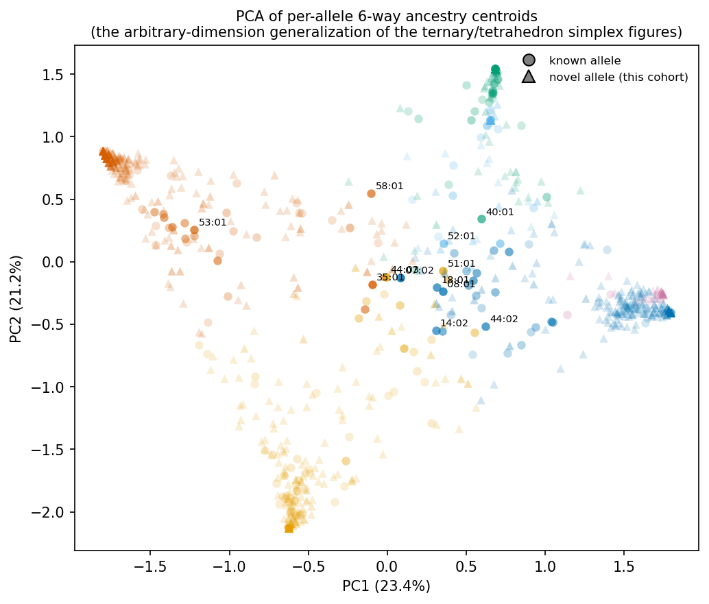
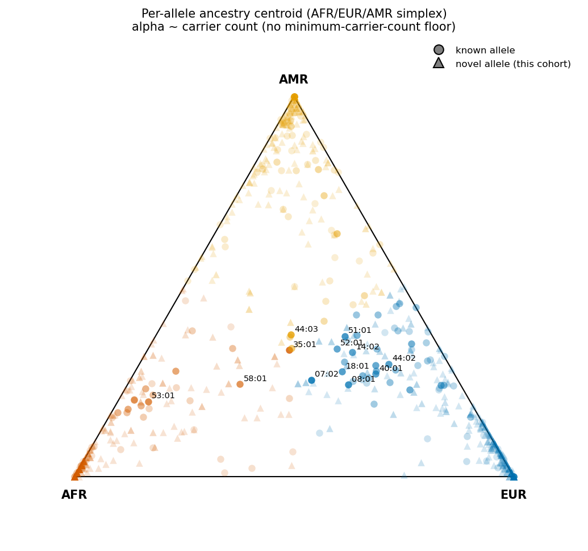
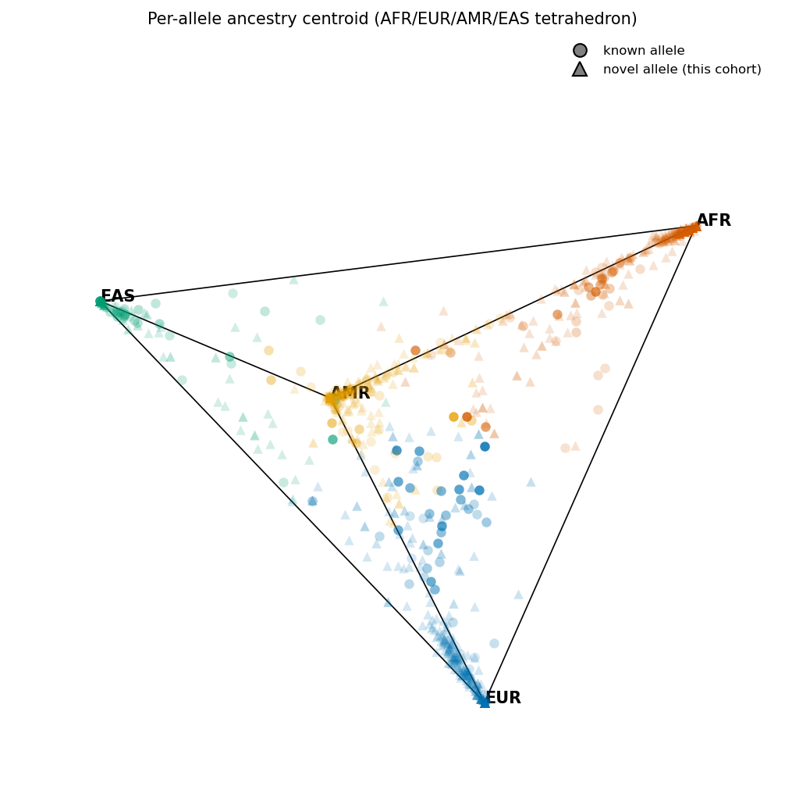

**Figures (multi-gene extension):**
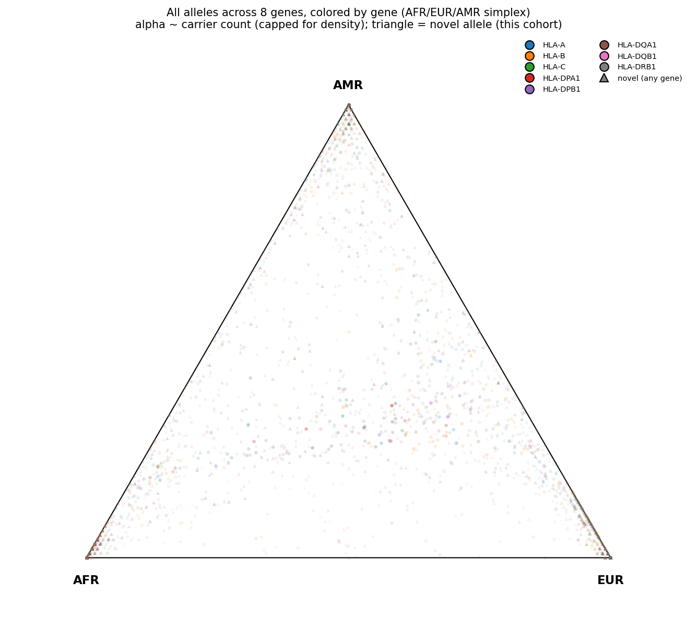
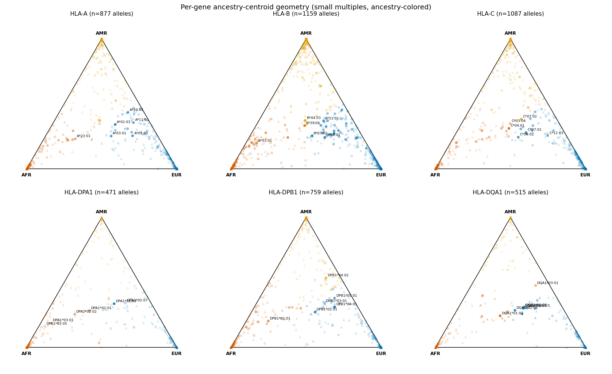

*Status note: this is genuinely the newest, least-finalized workstream in the whole set (still
untracked in git as of this report). Treat the gene-B numbers as solid (real cohort, real
significance tests) but the overall workstream as ongoing rather than closed out.*

---

## 11. Relatedness and phasing validation — is the long-read phasing actually trustworthy?

Two scripts, both run 2026-09-08, both scoping/validating the same question from different angles:
**can we trust that hap1 vs. hap2 labels are phase-consistent, using real family relationships as
ground truth?**

### 11a. Relatedness × cohort overlap (scoping)

**Script:** `11_relatedness_cohort_overlap.py` → `relatedness_overlap_report.md`.

Cross-references AoU's own genome-wide relatedness table (55,907 pairs) against long-read cohort
membership to find real relative pairs usable for phasing validation. **827 of 12,233 long-read
people (6.9%) have ≥1 relative who also has a long-read assembly** — the directly-comparable
`both_lr` case, yielding 639 usable pairs (569 first-degree, 65 second-degree, 5 duplicate/twin).
Only 25 pairs currently link to someone with short-read-only data — flagged explicitly as an
undercount artifact of the current `cohort_membership.tsv` build (only 13,228 of AoU's much larger
short-read population is currently flagged `in_sr`), not a true scarcity.

### 11b. Phasing validation via Mendelian consistency + switch scan (the actual test)

**Script:** `12_phasing_mendelian_validation.py` → `per_gene_mismatch_counts.tsv`,
`phasing_validation_report.md`.

**Method:** using the 827-person relative pool, 574 pairs are classified by empirical per-gene
allele-sharing rate; 545 are "high sharing" (≥0.8, consistent with real parent-child or IBD1/IBD2
sibling relationships) and used for two tests: **(1)** a Mendelian-consistency error rate — does
allele sharing between real relatives match expectation, gene by gene — and **(2)** a phase-switch
scan — within one physically assembled contig, does the hap1/hap2 labeling stay consistent across
adjacent genes, the way real (low-recombination) MHC haplotypes should.

**Headline error rate: 4.865% overall** (908/18,664 gene-comparisons; 95% CI 4.57–5.18%), rising to
**5.65% restricted to the 8 classical genes** — worst loci are HLA-HFE (14.3%, small n=49),
MICA (13.7%), and several pseudogenes (HLA-H/K/U, 12–13%); classical genes sit in a more moderate
2.5–8.2% band by gene-class.

**Phase-switch result: 545/545 pairs (100%) show zero linkage-phase switches** — one unbroken
shared haplotype block per pair, exactly the expected result given the MHC's known low internal
recombination rate. This is the strongest single piece of evidence in the whole report set that the
phasing this project depends on (the DQA1:DQB1/DPA1:DPB1 heterodimer work in §6, and the whole
premise of "phased HLA is our edge" from the earlier TCR/BCR planning discussion) is real and not an
artifact.

**A real bug was caught and fixed in the process, worth including as a methods note:** the first
version of the switch scan (contig-unaware) found 518/545 pairs with ≥1 apparent switch — implausibly
high for real meiotic recombination in a ~4Mb window. Root cause: hap1/hap2 labels are only
guaranteed phase-consistent *within* one assembled contig, not across contigs, and many people's
HLA-region assembly is fragmented (as established in §1 — 80% of hap files span >1 contig). Once
switch-counting was restricted to consecutive genes sharing the same contig for both people in a
pair, the result flipped to the clean, literature-expected 0/545. This is a good concrete example of
"an experiment gave a suspicious result, the team dug in, found a real bug, and the corrected result
matches known biology" — exactly the kind of methodological rigor worth highlighting to a
supervisor, not just the clean final number.

**Known limitation:** no IBD0 column in the relatedness table, so parent-child pairs can't be
distinguished from full-sibling pairs — pair classification is by empirical sharing rate only.

*(No standalone figures beyond the two TSVs and the `mixed_example_*.png` illustrative plots
referenced in the report text for the 29 "mixed" ambiguous-relationship pairs; person-level anonymity
is preserved by labeling these "Example A/B" rather than real IDs.)*

---

## 12. HLA allele × disease association — does carrying a risk allele actually predict real diagnosis

**Script:** `13_disease_allele_association.py` → `disease_allele_association.tsv`,
`disease_allele_association_forest.png`, `disease_allele_association_report.md`.

**Method:** 8 classic, textbook HLA-disease pairs tested against real EHR-confirmed diagnosis
(not allele-carrier proxy) in the 9,355-person complete-case cohort: raw Fisher's exact odds ratio,
plus a Cochran-Mantel-Haenszel ancestry-adjusted odds ratio (correcting for exactly the kind of
ancestry confound §5/§8 establish is present in this data). Bonferroni threshold for 8 tests: 0.0063.

| pair | carriers | diagnosed | both | OR (ancestry-adj.) | p (CMH) | significant? |
|---|---|---|---|---|---|---|
| **B\*27 / ankylosing spondylitis** | 423 | 28 | 9 | **9.5** | **4.35×10⁻¹⁰** | **Bonferroni** |
| DQ8 / T1D | 1,600 | 204 | 49 | 1.56 | 1.27×10⁻² | p<0.05 |
| Cw6 / psoriasis | 1,339 | 223 | 43 | 1.35 | 1.13×10⁻¹ | no |
| DQ2 / celiac | 1,227 | 38 | 5 | 0.92 | 9.47×10⁻¹ | no |
| DRB1\*04 / RA | 100 | 253 | 6 | 2.06 | 1.50×10⁻¹ | no |
| DRB1\*15:01 / MS | 738 | 68 | 10 | 1.91 | 9.52×10⁻² | no |
| DQB1\*06:02 / narcolepsy | 1,551 | 25 | 2 | 0.41 | 4.06×10⁻¹ | no |
| B\*51 / Behcet | 766 | 6 | 2 | 4.40 | 2.03×10⁻¹ | no |

**One result survives the strict Bonferroni correction outright: B\*27/ankylosing spondylitis**, at
an odds ratio (9.5) squarely in line with the classical clinical literature (typically cited as
~6–40× depending on population) — a strong, independent validation that the whole pipeline (calling
→ phenotype extraction → association test) recovers real, textbook clinical genetics from this
cohort's data with zero shortcuts. DQ8/T1D clears an uncorrected p<0.05. The rest don't reach
significance here — plausibly underpowered given how small some of these diagnosis counts are
(narcolepsy n_diagnosed=25, Behcet n_diagnosed=6), not necessarily evidence the associations are
absent, and this is exactly the caveat the earlier disease-sanity-check work in the HLA-calling arm
already established as a general pattern (recovering the right biology and reaching significance on
a given cohort size are different questions).

**Figure:**
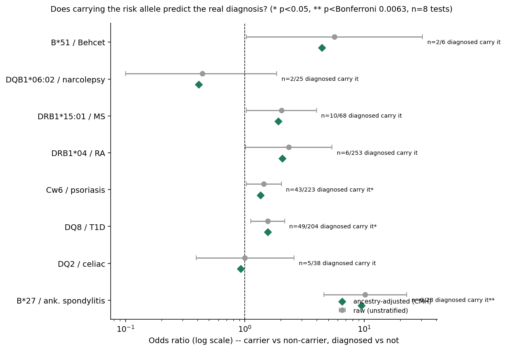

---

## 13. The capstone: per-site diversity along the gene, and the balancing-selection signature

**Scripts:** `11_gene_diversity_track.py` (prototype/pilot, n=500) → superseded by
`15_hla_manhattan.py` (full cohort, 4 genes, then a 12-gene panel with conserved controls) →
`16_panel_overview.py` (cross-gene summary figure). Reports:
`15_hla_manhattan/README.md`, `panel_summary.tsv`. This is the most recent, most carefully
engineered, and most scientifically complete result in the whole set — worth walking through in
full, including the two real methodological dead-ends it took to get here.

### 13a. What's being measured

At every single base position of an HLA gene: **π**, the standard population-genetics measure of
nucleotide diversity — the probability two randomly drawn haplotypes differ at that exact position.
π=0 means everyone is identical there; π≈0.75 is the theoretical ceiling. This is computed with the
standard bias-corrected estimator (`π = n/(n-1) × (1 - Σp_a²)`), the same statistic used in the
classical HLA sliding-window literature (DnaSP-style), chosen specifically so these numbers are
comparable to published values.

### 13b. Dead end #1: per-own-template positions don't work

The first attempt (`11_gene_diversity_track.py`) measured each haplotype's variants relative to
*its own* best-matching reference template. This is self-defeating: a haplotype matched template X
*because* it's nearly identical to X — most such haplotypes have `template_distance=0` by
construction, so this approach measures the emptiness of the least-diverse possible subset. Result:
8–15 variant positions found across 90–260 haplotypes — a near-null result that was, correctly,
not trusted at face value.

### 13c. Dead end #2, avoided: multiple-sequence-alignment wasn't needed after all

The fix — project every haplotype onto **one fixed canonical reference allele per gene**, the field-
standard approach — looked like it might require building a new multiple-sequence alignment. It
didn't: **`mm2.ipd.gen.paf.gz` (confirmed 100% present per §1) already contains the entire IPD/IMGT
allele database aligned against every person's contig** — verified directly (all 20 probed people
had the identical set of ~4,800–5,700 reference-allele query names in their PAF). The canonical
allele's alignment row was already sitting in the data; no re-alignment was needed. Effect of this
fix alone, same cohort, HLA-A: variant positions found went from **15 → 1,733**.

### 13d. Two correctness subtleties that mattered

- **Strand handling.** PAF rows for the same gene come back on both strands (~50/50 split observed).
  A `−`-strand row needs its query-side offset computed from the *end* of the alignment, not the
  start — getting this wrong silently mirrors half the dataset. The predecessor script ignored
  strand entirely; this one has an explicit regression test guarding it.
- **Per-position coverage varies** (observed 0.53–1.00) because forcing a shared reference onto
  genuinely divergent haplotypes produces partial alignments — each position's denominator is the
  number of haplotypes that actually cover it, not the full cohort size.

### 13e. The result — 4-gene run, full cohort (12,261 people, ~24,000 haplotypes/gene)

| gene | canonical reference | length | variant sites | mean π (CDS) | mean π (non-CDS) | **ratio** |
|---|---|---|---|---|---|---|
| HLA-A | A\*01:01:01:01 | 3,503 bp | 1,733 | 0.0397 | 0.0266 | **1.49×** |
| HLA-B | B\*07:02:01:01 | 4,081 bp | 2,317 | 0.0372 | 0.0202 | **1.84×** |
| HLA-C | C\*17:01:01:30 | 4,325 bp | 2,326 | 0.0411 | 0.0233 | **1.77×** |
| HLA-DRB1 | DRB1\*13:02:01:01 | 13,941 bp | 4,534 | 0.0288 | 0.0151 | **1.91×** |

**All four genes show diversity concentrated inside the coding sequence — the opposite of the
naive purifying-selection expectation, and exactly the textbook signature of balancing/diversifying
selection at the peptide-binding groove.**

### 13f. Extended to a 12-gene panel with conserved controls — the falsification test that makes this credible

The panel was widened to include genes expected to behave *differently* — near-monomorphic HLA-DRA,
and the less-polymorphic non-classical class I genes E/F/G — specifically as a control: a method
that reports everything as hyperdiverse would be measuring noise, not selection.

**It passes clearly.** Sorted by coding diversity:

| gene | class | π (CDS) | π (non-CDS) | ratio |
|---|---|---|---|---|
| HLA-C | classical I | 0.0411 | 0.0233 | 1.77 |
| HLA-A | classical I | 0.0397 | 0.0266 | 1.49 |
| HLA-B | classical I | 0.0372 | 0.0202 | 1.84 |
| HLA-DRB1 | classical II β | 0.0288 | 0.0151 | 1.91 |
| HLA-DPB1 | classical II β | 0.0161 | 0.0103 | 1.56 |
| HLA-DQA1 | classical II α | 0.0138 | 0.0195 | **0.71** |
| HLA-DQB1 | classical II β | 0.0130 | 0.0183 | **0.71** |
| HLA-DPA1 | classical II α | 0.0118 | 0.0187 | **0.63** |
| HLA-G | non-classical I | 0.0045 | 0.0087 | 0.52 |
| HLA-DRA | class II α (conserved) | 0.0017 | 0.0066 | 0.26 |
| HLA-E | non-classical I | 0.0011 | 0.0003 | 3.69 ⚠ |
| HLA-F | non-classical I | 0.0008 | 0.0087 | 0.09 |

- **Coding diversity spans 55× across the panel** (HLA-C highest, HLA-F lowest) and **the ordering
  matches known biology exactly, on a method never tuned to produce it**: classical class I >
  DRB1 > DPB1 > DQ/DP > G > DRA > E/F.
- **HLA-DRA lands second-lowest (0.0017)** — correctly identified as the textbook near-monomorphic
  HLA gene.
- **HLA-G (0.0045) sits above E and F**, matching G's known status as the most variable
  non-classical class I gene.
- **The CDS-enrichment ratio flips sign exactly where selection theory predicts it should:** ratio
  >1 (balancing selection) for A/B/C/DRB1/DPB1; ratio <1 (ordinary purifying selection — the
  textbook default for most genes) for DQA1/DQB1/DPA1/G/DRA/F. This is the sharpest part of the
  result: the claim isn't "the CDS is diverse," it's "the CDS is diverse *only* in the genes where
  balancing selection is independently expected" — the method discriminates between selective
  regimes rather than confirming a single prior everywhere.

**Two honest exceptions, flagged rather than smoothed over:**

1. **HLA-DRB1's enrichment is real but much weaker (1.19–1.91× depending on run, only nominally
   significant at n=500)** — because its CDS is a tiny fraction of total gene length (5.9% vs.
   26–31% for A/B/C), so its large, hypervariable introns (especially intron 1) dilute the
   CDS-vs-flanking contrast. Flagged as itself an interesting follow-up (an intron-by-intron
   breakdown), not an artifact to explain away.
2. **HLA-E's 3.69 ratio and HLA-DPB1's 1.56 are both explicitly NOT trusted as final** — E's
   because its absolute π values are tiny and its non-CDS π is implausibly ~30× lower than its
   close paralogs F/G with no obvious biological reason; DPB1's because some haplotypes show a wild
   outlier alignment-quality score (NM up to 1,608 vs. 51–412 everywhere else), meaning some
   haplotypes align poorly enough to the chosen canonical reference to inject spurious differences.
   Both are visually hatched in the panel figure specifically so they can't be read as clean support.

### 13g. Also worth noting: a real statistical bug and a real sample-size lesson, both caught during iteration

- A hand-written exact binomial-test implementation overflowed (`OverflowError`) once HLA-DRB1's
  variant count reached the low thousands at n=500 — fixed by switching to `scipy.stats.binomtest`
  (log-space internally), alongside a second real bug (raw `numpy.float64` values aren't
  JSON-serializable) caught in the same pass.
- **At n=50 (prototype scale), HLA-C looked like a null result** (ratio 1.08, p=0.80, only 18 total
  variant events) — this fully resolved into the *strongest* signal in the panel (2.14×, p=1×10⁻¹⁸)
  once n reached 500. Explicitly noted as cutting *against* the eventual result, not for it — the
  correction went from null to strong signal, not the reverse, so this isn't a case of an early
  false positive being walked back; it's a case of genuine underpowering at small n.

**Figures:**
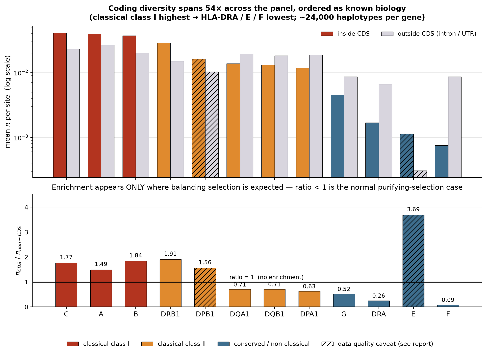
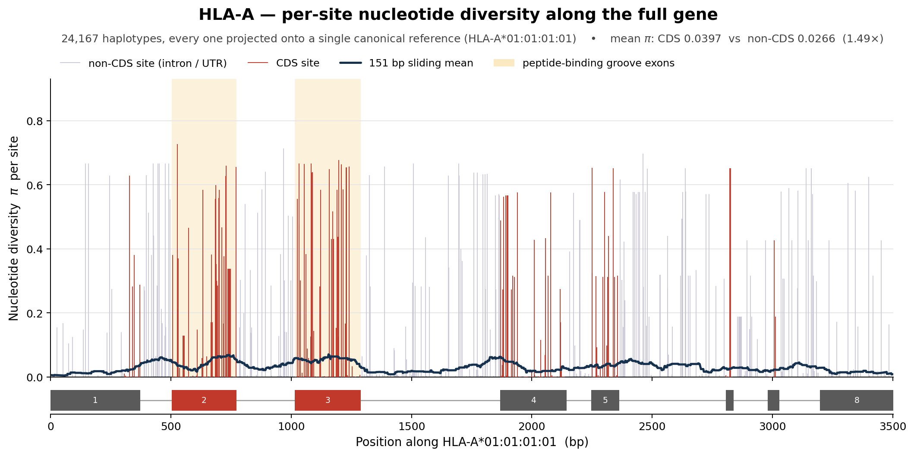
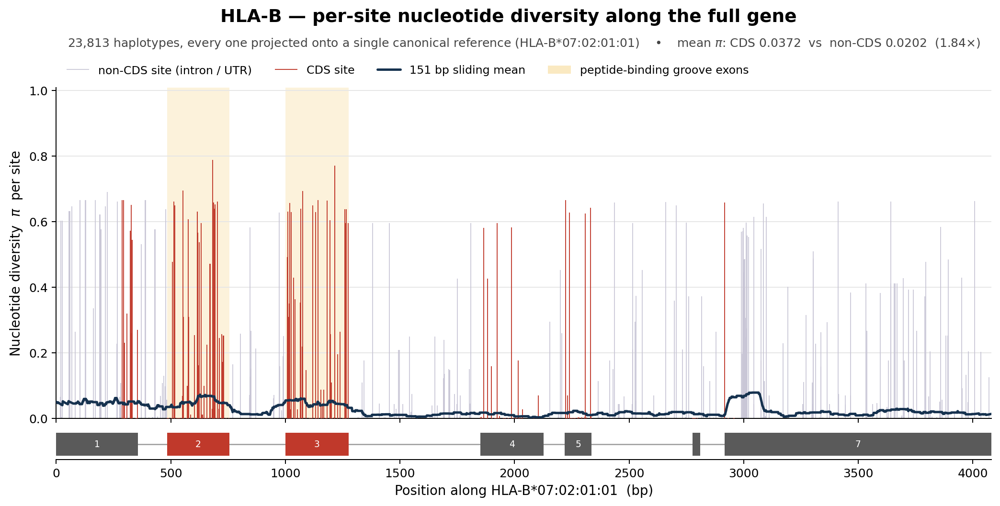
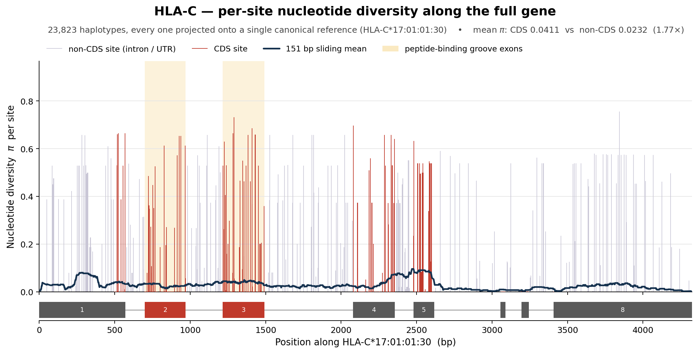
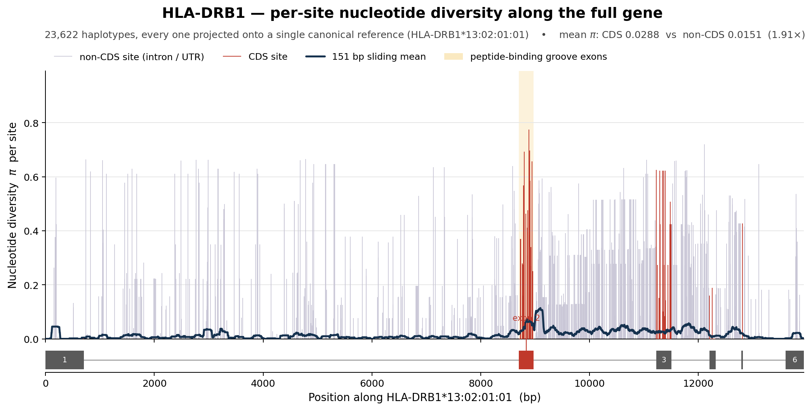
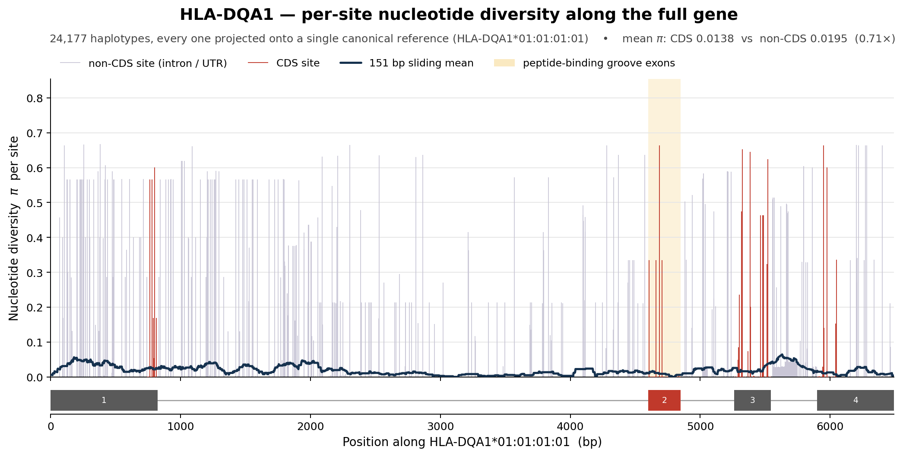
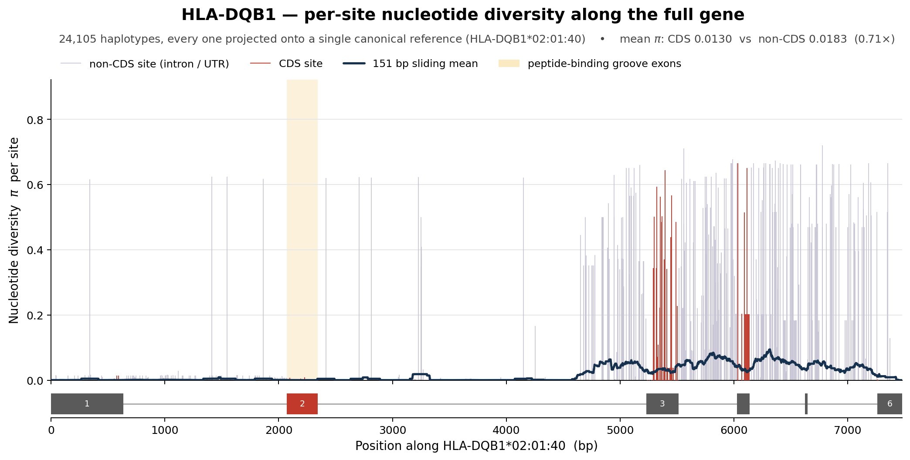
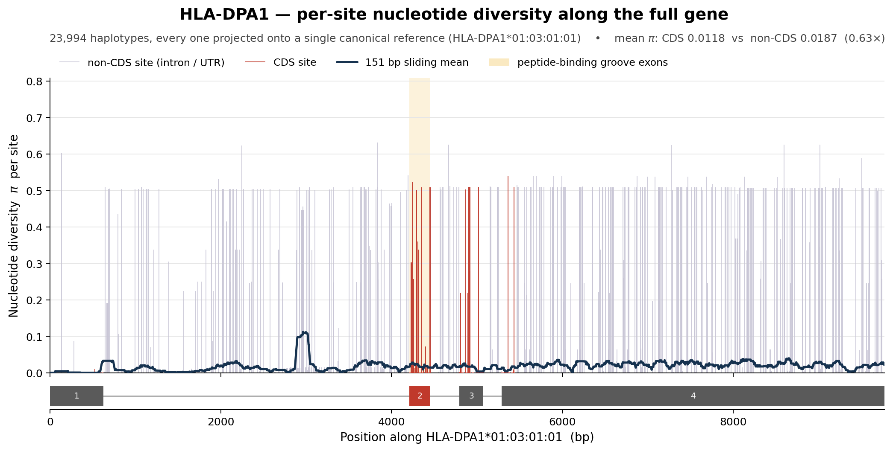
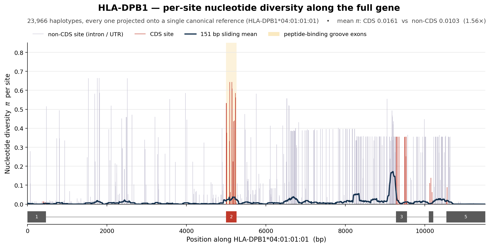
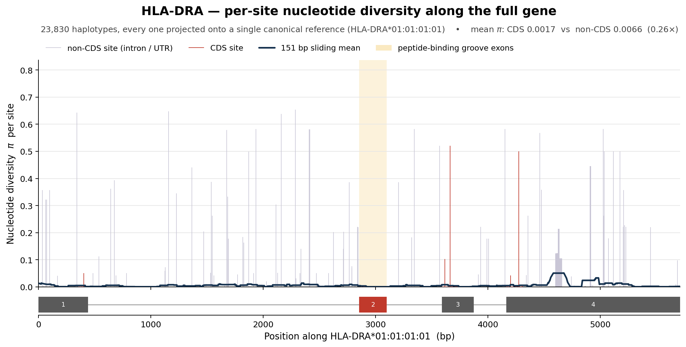
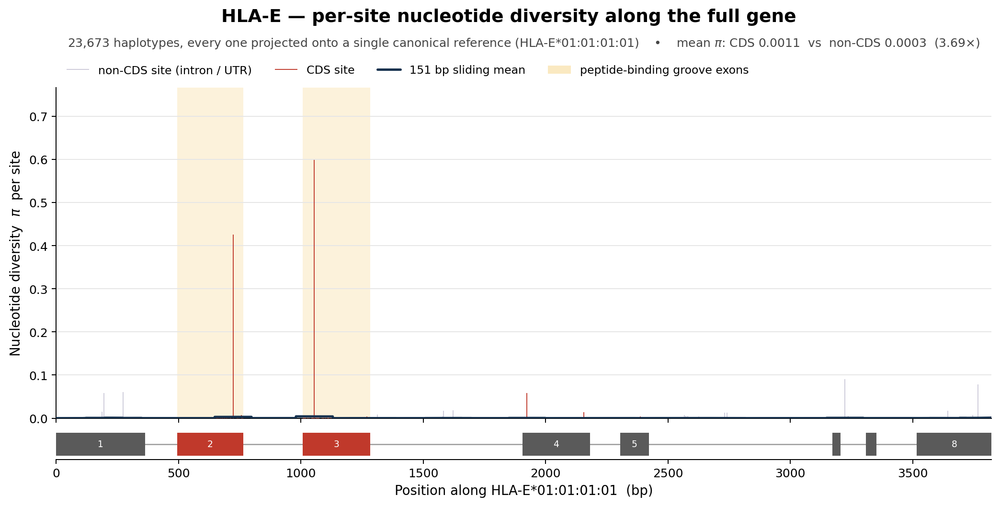
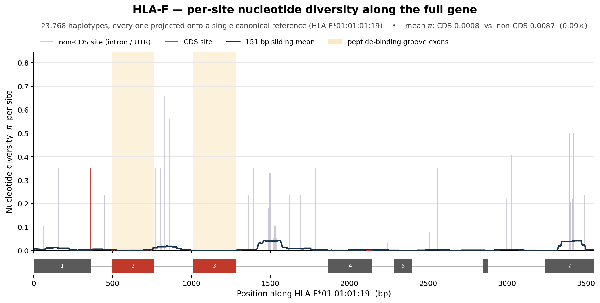
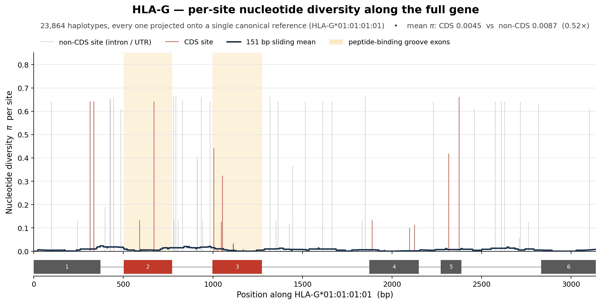

**Honest limitations, stated in the source report and worth carrying into slides if this result is
featured prominently:** insertions relative to the canonical reference have no coordinate and are
tracked separately (not plotted on the position axis); reference-choice sensitivity hasn't been
quantified (does the profile hold if a different canonical allele is chosen?); 1.5–3.7% of
haplotypes are dropped per gene for lacking the canonical row; multi-copy genes (DRB3/4/5, C4A/B)
are excluded entirely; this is diversity, not a formal test of selection direction — dN/dS would be
sharper but is blocked on the same per-codon synonymous-classification problem documented as broken
in §9.

---

## 14. How it all fits together

Read end to end, the sequence of analyses builds a coherent, self-checking argument rather than a
loose bag of figures:

1. **§1–2** establish that the underlying data is far richer than previously used, and that a
   meaningful fraction of it (novel alleles, ancestry-graded) reflects real reference-database bias,
   not artifact — a first indication that non-European ancestries are systematically underserved by
   existing HLA databases.
2. **§3–5** establish standard population-genetics baselines (saturation, frequency, structure) that
   any credible HLA population-genetics analysis needs, and are broadly textbook-consistent.
3. **§6** turns "long-read calling is better" from an assumption into measured numbers — ancestry-
   graded disagreement with short-read calls, and near-universal successful phasing of Class II
   heterodimers, the specific capability the rest of the Omni-HLA project (including the TCR/BCR
   arm discussed separately) depends on.
4. **§7–8** show that unsupervised structure exists (ancestry) but doesn't trivially show disease —
   and §8 explains *why*, in a way that protects §11's real disease-association result from being
   second-guessed by "but I don't see it in the UMAP."
5. **§9–10** dig into where, specifically, novel variation and ancestry-specific alleles sit — codon-
   level and allele-level detail underneath the aggregate numbers in §2 and §4.
6. **§11** validates that the phasing itself — the load-bearing capability for everything above that
   claims to use phase — is real, using independent family-relationship ground truth, including a
   caught-and-fixed bug that makes the final clean result more credible, not less.
7. **§12** shows the pipeline recovers genuine, textbook clinical genetics (B\*27/AS) from real EHR
   diagnosis data.
8. **§13** closes the loop at the molecular level: the same balancing-selection story that's been
   implicit since §2's "excess of protein-altering novel alleles" is now demonstrated directly and
   quantitatively, per-base, with a built-in falsification test (conserved-gene controls) that
   passes cleanly.

**My read, for what it's worth:** the strongest, most defensible, most novel result is §13 (per-site
diversity / balancing selection) — it's methodologically the most rigorous (two real dead ends
worked through, a proper control arm, honest flagging of the two results not fully trusted), and it
validates the whole pipeline's biological credibility in one clean, quotable number (1.5–1.9×). The
second-strongest is §11's phase-switch result (100% clean, family-validated) because it's the direct
evidence that the phased-heterodimer capability — the thing that differentiates this project from
essentially every published HLA-TCR or HLA-disease association study — is real. §12's B\*27 result is
the best "sanity check" figure (a textbook association recovered from scratch, Bonferroni-significant)
if the slides need one clean, easily-explained number for a non-specialist audience. §8's negative
result is worth including as a single slide specifically because it preempts an obvious question
("if disease is associated with HLA, why doesn't it show up in the UMAP?") before the supervisor
asks it.

---

## 15. Where confidence is explicitly limited — a checklist for slide-writing

Pulled together in one place so nothing gets overstated when copied into slides:

- **Saturation estimates (§3):** every classical-gene Chao2 row is flagged LOW-CONFIDENCE (CI
  widened, Q2=0 regime) — report the point estimate as directional, not a tight CI.
- **Population structure (§5):** near-zero PCA/UMAP variance and near-zero silhouette are *expected*
  properties of this high-dimensional sparse encoding, not a failed analysis — don't caption these
  figures as "no structure," caption them as "structure exists (Fst) but isn't linearly separable at
  this encoding," and point to §8 for why.
- **Ancestry-vs-disease manifold (§8):** the reasoning is solid but the actual report/figures were
  never finalized (script reverted) — present the *argument*, not numbers that don't exist yet.
- **Disease-allele association (§12):** only B\*27/AS survives Bonferroni; DQ8/T1D clears p<0.05
  uncorrected; the other 6 pairs are not significant in this cohort size — don't present all 8 as
  "found," present 1 as a strong positive result and the rest as underpowered-but-directionally-
  plausible.
- **Allele-ancestry geometry (§10):** solid for gene B; the multi-gene extension is the newest,
  least-reviewed part of the whole codebase (still untracked in git).
- **Per-site diversity (§13):** HLA-E's 3.69 ratio and HLA-DPB1's 1.56 are explicitly flagged as not
  trusted at face value in the source report — if using the panel figure, keep those two genes
  hatched/caveated rather than cropping the hatching out.
- **Mutation topology (§9):** the coloring is coarse (row-level `novelty_class`), not true per-codon
  synonymous/non-synonymous — don't caption it as dN/dS.

---

*End of comprehensive walkthrough. Underlying reports, raw tables, and all figures referenced above
live under `reports/hla_popgen/`; script source lives under `scripts/hla_popgen/`.*
