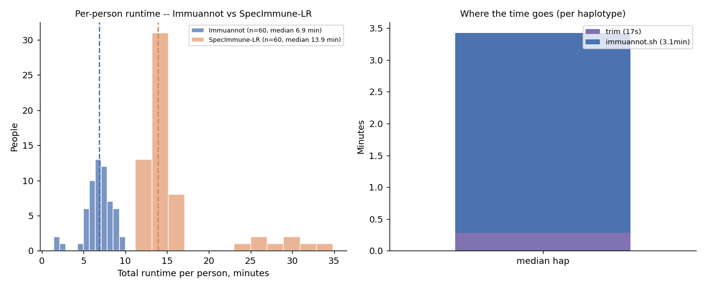
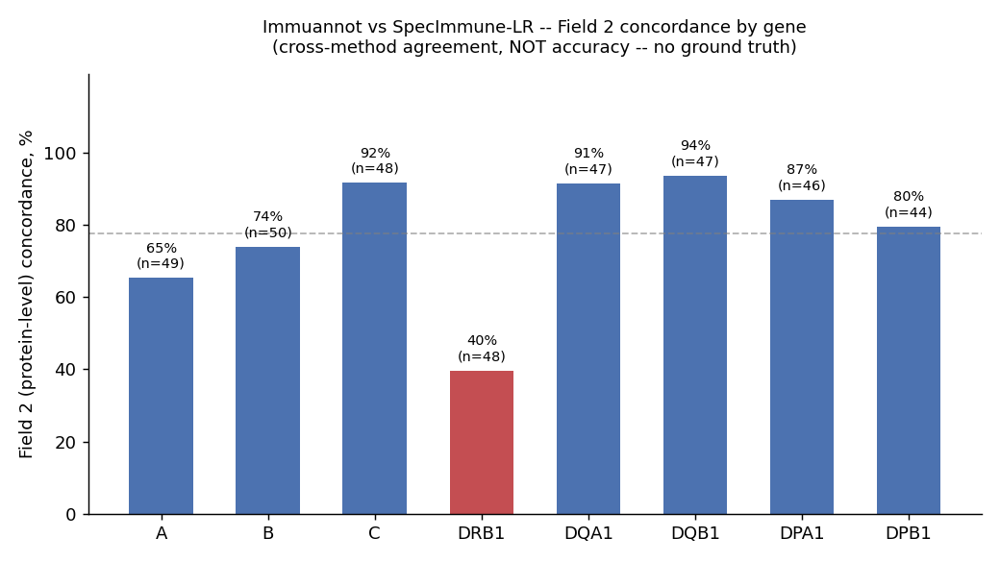
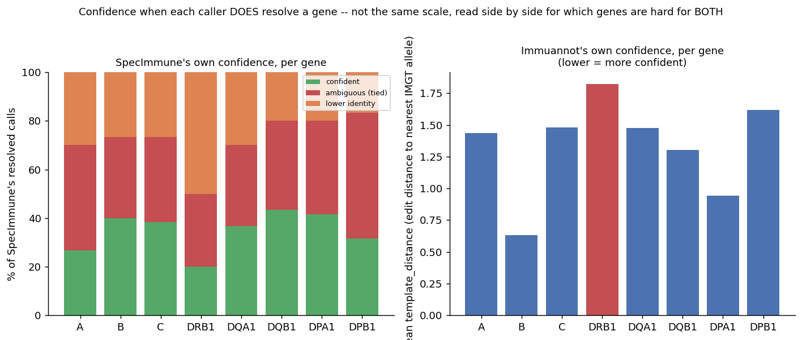

# Immuannot pilot: cross-method comparison against SpecImmune-LR

**2026-07-22.** A 60-person pilot running [Immuannot](https://github.com/YingZhou001/Immuannot)
(assembly-based HLA typing, minimap2 against IPD-IMGT/HLA) on the same Experiment D cohort already
typed by SpecImmune-LR, AoU-native, and SpecHLA. This report compares Immuannot against
SpecImmune-LR specifically — both derive from the same long-read sequencing (a phased assembly vs.
the raw reads), making them a more independent pair than the AoU/SpecHLA short-read pair, though
not fully independent.

**No ground truth.** This is cross-method *agreement*, not accuracy. Where the two callers
disagree, that alone cannot say which one is right — the same adjudication limit already logged in
`context/DECISIONS.md` for the original 3-way bake-off. What agreement *can* do is show **where**
the two methods diverge, which turns out to line up tightly with everything already known about
this cohort from earlier experiments.

## Headline result

**DRB1 is confirmed the hardest locus in this cohort, now by five independent lines of evidence:**
this pilot's own cross-method disagreement (lowest Field 2 concordance of any gene, 40% vs. 65-94%
elsewhere), SpecImmune's own confidence flags (worst of any gene — half its DRB1 calls are
`lower_identity`), Immuannot's own confidence signal (`template_distance`, highest of any gene at
1.82), plus two independent findings from earlier sessions (the AoU/SpecHLA field-cascade breakdown
in Experiment D, and DRB1's excess homozygosity in the callset validation report). No single one of
these would be conclusive alone; together they are.

**Neither caller is simply "better" by a naive completeness count.** SpecImmune never returns
nothing when Immuannot has a call (0 such cases across 480 person×gene pairs) — but a large
fraction of what it *does* return is self-flagged as uncertain (tied candidates or sub-threshold
identity), especially at DRB1 and DPB1. Immuannot abstains more often (25 cases) but arguably more
honestly. A resolution-rate comparison alone would favor SpecImmune and miss this.

## Method note: a real bug found and fixed mid-analysis

Immuannot flags novel/undocumented sequence by embedding the literal string `"new"` as a field
position in its own allele output (e.g. `DRB1*15:03:01:new`) — not as a separate attribute, contrary
to its own documentation. The first version of this comparison treated `"new"` as a real value and
string-compared it against SpecImmune's numeric fields, forcing a mechanical mismatch wherever it
appeared. Fixed by truncating the field list at `"new"` (correctly "unresolved this deep," not "a
disagreement"). The fix nudged every gene's Field 2/3 concordance up slightly (e.g. C: 83%→92%) —
but barely moved DRB1 (37%→40%), confirming DRB1's low concordance is real, not a parsing artifact.
All figures and numbers below are post-fix.

**DRB1 Field 4 is a separate, still-unresolved case:** even after the fix, concordance is exactly 0%
in all six ancestry groups. Spot-checking the raw alleles ruled out the simplest explanation (one
caller silently defaulting to a placeholder value) — both callers show real value diversity at that
position, just diversity that never coincides on the same person. Read this as "no measurable
signal at DRB1 Field 4," consistent with both callers' documented low confidence there, not as its
own independent finding.

## 1. Completion and runtime

57 of 60 attempted people produced calls; 0 were skipped before the pipeline even started
(confirming all 60 cohort members do have revio-platform assembly data, per
`reports/lr_data_census/`); only one haplotype failed, at the trim stage. Per-person total runtime:
median 6.9 min, range 1.4-10.0 min — comfortably inside the pipeline's own 30-min budget, and driven
almost entirely by `immuannot.sh` itself (median ~3.1 min/haplotype), not the trim step (median
~17s/haplotype).

## 2. Cross-method concordance — Field 2 (protein-level), the headline metric

Field 2 is the comparison level that matters most: it is the coarsest level that still distinguishes
a *different protein*, and — unlike fields 3-4 — it is largely insulated from the DB-version
confound (Immuannot ships IMGT release `Data-2024Feb02`; SpecImmune in Experiment D used `3.64.0` —
different releases rename alleles at the deeper, silent fields far more than at Field 2).

DRB1 sits alone at 40%, roughly 25 points below the next-worst gene (A, 65%). C, DQA1, and DQB1 all
concord above 90%.

## 3. Confidence — how sure is each caller when it does resolve a gene?

Two different confidence signals, not on a shared scale, shown side by side rather than combined:
SpecImmune's own tie/identity flags (already used to define "confident" in `analyze_experiment_d.py`
— not a new bar invented for this report), and Immuannot's own `template_distance` (edit distance to
the nearest known IMGT allele; lower is more confident).

Both signals independently mark DRB1 as the least-confident gene — not just disagreeing with each
other, but each doubting itself there too.

## Data & reproducibility

- Script: `scripts/diagnose_immuannot_pilot.py` (also the source of `field2_by_gene.png`,
  `confidence_comparison.png`, and `runtime.png` — same numbers as the tables, not retyped).
- Run via `pixi run -e spechla -- python3 scripts/diagnose_immuannot_pilot.py` (needs matplotlib,
  unlike the pipeline scripts themselves).
- Aggregate-only: raw per-person calls, timing, and the per-individual detail CSV all stay on the
  Workbench VM (`~/pipeline_outputs/immuannot_calls.tsv`, `immuannot_timing.tsv`,
  `immuannot_pilot/analysis/immuannot_vs_specimmune_detail.csv`) — never committed, per the
  standing egress rule (`context/DECISIONS.md`).
- Companion pipeline scripts: `scripts/run_immuannot_person.py` (the production run, whole-block
  trim via each haplotype's own `.paf` alignment), `scripts/setup_immuannot.sh`.
- A separate padding-tightening experiment (`scripts/run_immuannot_pad_sweep.py`) tested whether the
  trim could be narrowed further (down to the literal gene body, or even a deliberate truncation
  positive control) — result: no, generous whole-block trimming is necessary for Immuannot's own
  accuracy at several genes, particularly DQA1/DQB1 on fragmented assemblies. Not adopted; the
  production script's existing trim is unchanged.
